# 比特币诞生背景

# 去中心化

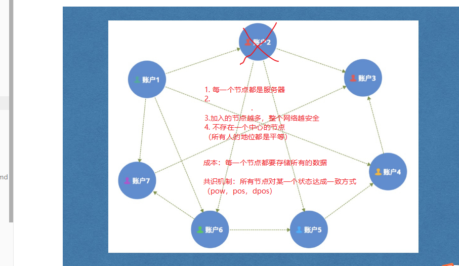


# 比特币简介

# 记账方式对比

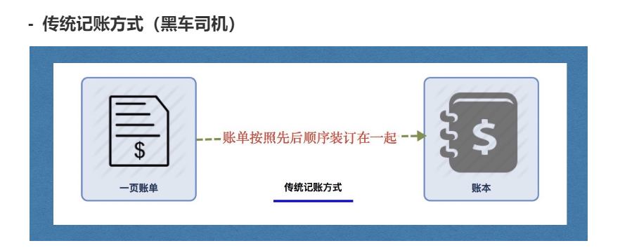


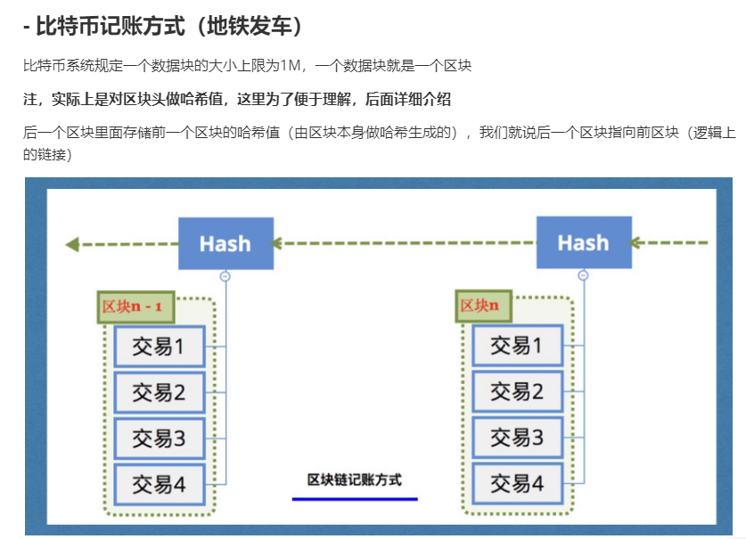


## 4. 详细对比

| 对比项           | 传统记账                   | 比特币记账                                |
| ---------------- | -------------------------- | ----------------------------------------- |
| 交易记录存储位置 | 账单                       | 区块                                      |
| 记录集合         | 账本                       | 区块链                                    |
| 记账周期         | 写满了翻页（无论时间多久） | 10分钟翻页（无论交易多少， 容量有上限1M） |
| 记账人           | 老会计                     | 比特币客户端节点                          |
| 奖励             | 死工资                     | 记账奖励+手续费                           |
| 记账成本         | 鸵鸟蓝黑墨水               | 非常耗电/ 设备损耗                        |
| 账本数量         | 1本                        | 所有节点人手一本                          |


# 比特币核心安装

启动比特客户端：比特币核心，这个钱包最初是由中本聪开发的，可以通过配置文件，连接到不同的网络：

配置文件名字：bitcoin.conf:

> %appdata% /Bitcoin文件夹


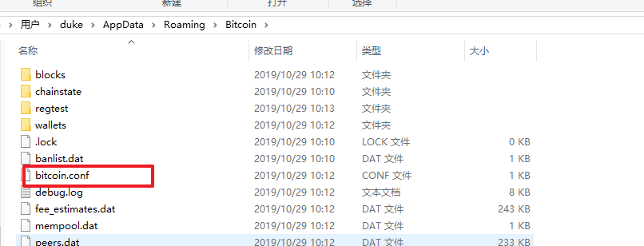

1. 主网（真实的比特币网络），黄颜色，默认
2. 真实的测试网络（全世界都在用的，需要同步账本：30G左右，用于测试），绿颜色
   1. testnet=1

3. 本地开发网络（用于开发使用）
   1. regtest=1


修改后，重启程序


简单测试：

1. 帮助=>调试窗口=》控制台输入：

   1. generate 101   ==> 会挖矿得到比特币

      


# 几个概念

### 钱包

随机数=》私钥=》公钥=>地址


地址：银行卡号（1A1zP1eP5QGefi2DMPTfTL5SLmv7DivfNa）

私钥：密码


一般会存储一个文件中wallet.dat中，里面可以存储N多个秘钥对。

在比特币系统中，每个人可以随意拥有N多个秘钥对

尽量转账的时候，每个地址都只使用一次。

这些地址都会统一的由wallet.dat来管理

每次进行转账时，不需要指定付款地址，客户端会自动处理。


钱包本身指的是wallet.dat文件。但是这个文件是由Bitcoin-Core（比特币核心）管理的

所以把比特币核心成为钱包。


比特币核心：PC端的，全账本钱包（里面会下载所有的账本数据240G左右）

手机端的钱包：Imtoken，轻钱包（里面只包含和自己账户相关的账本数据）


### 挖矿

1. 挖矿可以解决货币发行问题：全世界的人都可以公平竞争

2. 挖矿的人越多，作恶的几率越小，因为校验（是否有权利花费，是否有足够的金额）的人变多了。

3. 具体挖矿的思路：

   1. 在某一个时间内，交易数据是确定的（100条）。
   2. 系统会确定一个难度值：
      1. 系统每隔两周（2016个区块）会根据前两周平均出块的时间计算出来一个难度值A
      2. 根据难度值A可以推算出一个哈希值。target1

   3. 我们挖矿是要寻找一个随机数num，使得sha256(num + 交易的数据) < target1
   4. target1的规则：具有N多个前导零


举例：

num : 0       sha256(num + 交易的数据): 001234566...    target1: 00000000100000000000, 不满足

num : 1       sha256(num + 交易的数据): 0001234566...    target1: 00000000100000000000, 不满足

...

num : 5000       sha256(num + 交易的数据): 0000000000001234566...    target1: 00000000100000000000, 满足


此时：随机数num：5000，当前区块的哈希值：000000000000123456787

这两个数据会写入到区块，存储到账本中。


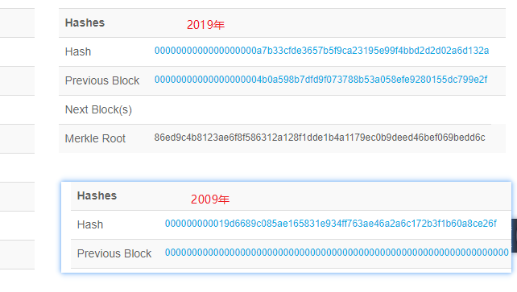


### 算力

矿机

矿场

矿池

# 几个数据

btc总量：2100万

平均出块时间：10分钟

难度值调整时间：2016个区块调整一次，大约2周

区块容量：1M

交易效率：7笔/秒（最多）

单位转换：1BTC = 10^8 聪(sat)


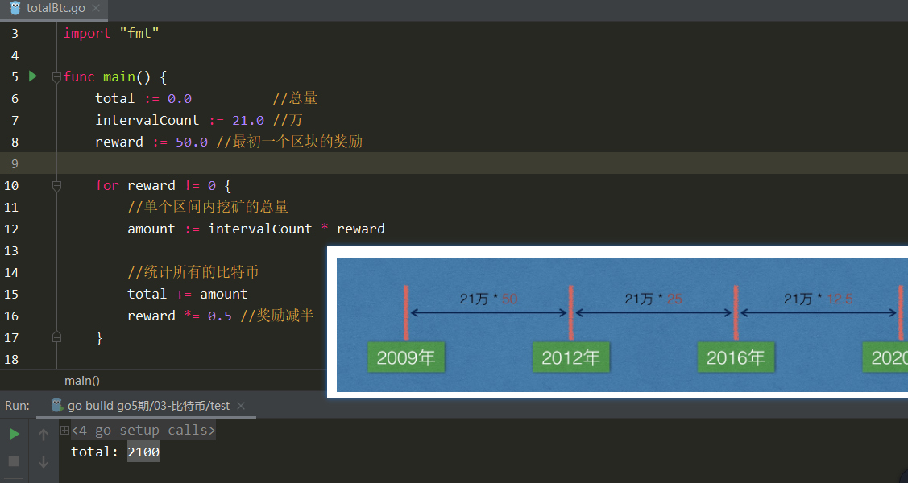


```go
package main

import "fmt"

func main() {
	total := 0.0          //总量
	intervalCount := 21.0 //万
	reward := 50.0 //最初一个区块的奖励

	for reward != 0 {
		//单个区间内挖矿的总量
		amount := intervalCount * reward

		//统计所有的比特币
		total += amount
		reward *= 0.5 //奖励减半
	}

	fmt.Println("total:", total)
}
```


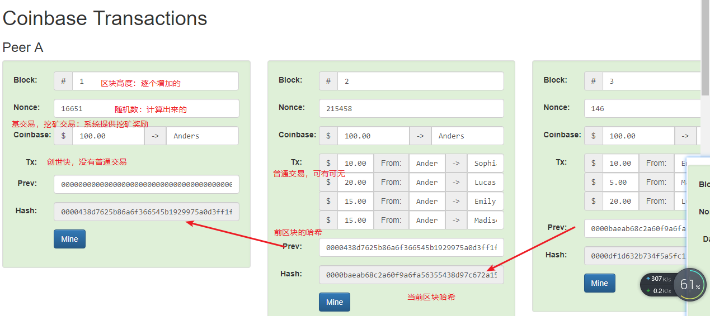


demo:https://anders.com/blockchain/

难度值：00010000...


# 交易流程介绍

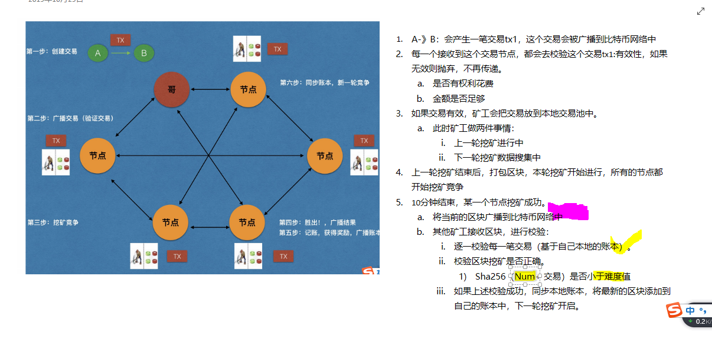

> 1. A-》B：会产生一笔交易tx1，这个交易会被广播到比特币网络中
>
> 1. 每一个接收到这个交易节点，都会去校验这个交易tx1:有效性，如果无效则抛弃，不再传递。
>
> 2. 1. 是否有权利花费
>    2. 金额是否足够
>
> 3. 如果交易有效，矿工会把交易放到本地交易池中。
>
> 4. 1. 此时矿工做两件事情：
>
>    2. 1. 上一轮挖矿进行中
>       2. 下一轮挖矿数据搜集中
>
> 5. 上一轮挖矿结束后，打包区块，本轮挖矿开始进行，所有的节点都开始挖矿竞争
>
> 6. 10分钟结束，某一个节点挖矿成功。
>
> 7. 1. 将当前的区块广播到比特币网络中
>
>    2. 其他矿工接收区块，进行校验：
>
>    3. 1. 逐一校验每一笔交易（基于自己本地的账本）。
>
>       2. 校验区块挖矿是否正确。
>
>       3. 1. Sha256（Num+ 交易）是否小于难度值
>
>       4. 如果上述校验成功，同步本地账本，将最新的区块添加到自己的账本中，下一轮挖矿开启。


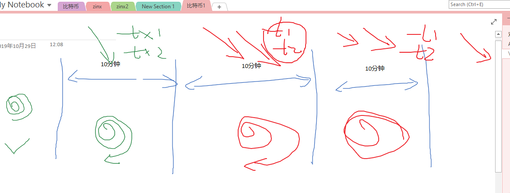


疑惑：


新连接进来的节点，会认为链条最长的链是主链。

主链：积累了最大工作量的链条就是主链。N个前导最多的区块


如果作恶（篡改了某一个交易的数据），后续区块就不满足前导零的特点，系统就会判断为无效区块。其他人不会去同步它的数据。

如果想作恶成功，则需要基于修改的区块进行挖矿，追赶主链，使得自己成为最长的链（要求有51%的算力），这个几乎不可能。


所以，区块链可以防止篡改。


# 使用技术点

## 非对称加密,数字签名：

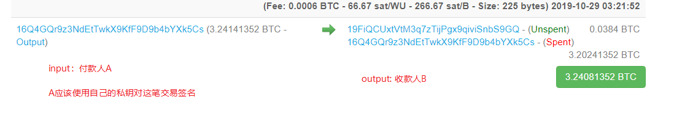


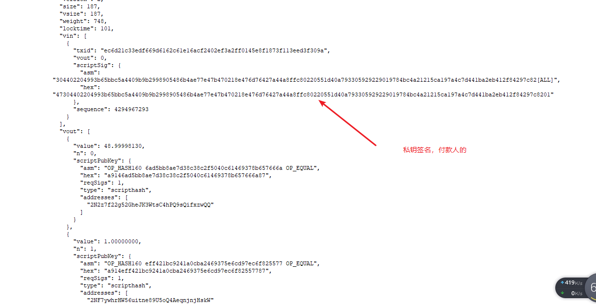


1. 发起一笔转账

2. 拷贝交易ID:  a31902237b8269c4b9bd308572c6c7cc72face26f124ffddf2ee8e8cde71d8b0

3. 帮助=》调试窗口=》控制台：

   > gettransaction  a31902237b8269c4b9bd308572c6c7cc72face26f124ffddf2ee8e8cde71d8b0
   >
   > 此时得到json结构，

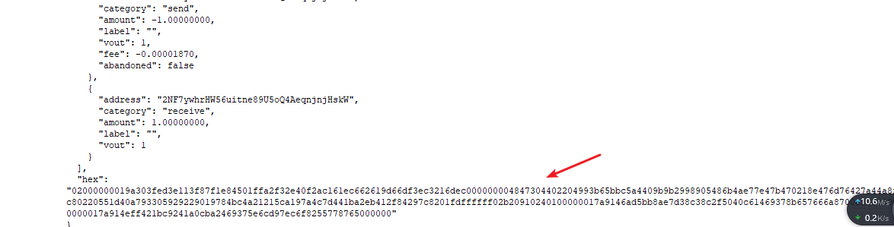


4. 复制：hex字段的数据
5. decoderawtransaction  hex 数据   //即可


## 挖矿(工作量证明)

拿一个证书，能够证明你做了一件事情。

驾照 =》会开车

教师资格证=》讲课

。。。


比特币系统：随机数 =》做过有效的哈希运算

特点：

1. 获取的过程很困难
2. 验证的过程很简单


hashTest.go

```go
package main

import (
	"crypto/sha256"
	"fmt"
)

func main() {
	data := "helloworld"

	for i := 0; i < 1000000; i++ {
		hash := sha256.Sum256([]byte(data + string(i)))
		fmt.Printf("hash:%x, i:%d\n", hash[:], i)
	}
}

```

5个0前导的数值在100万个数中没有找到！


## 比特币地址

使用ecc椭圆曲线=》一种高效的非对称加密算法

随机数=》私钥=》公钥=》地址


# 区块结构

### 区块头：

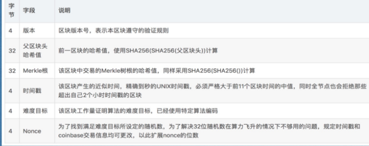


### 区块体

- Coinbase交易：

> 第一条交易，挖矿奖励矿工。永远是第一条，没有输入（钱的来源），只有输出（钱的流向）

- 普通转账交易:

1. input:输入，表明钱的来源

2. output:输出，表明钱的流向

3. 每笔交易包括付款方、收款方、付款金额、手续费等等。


### 

概述：


