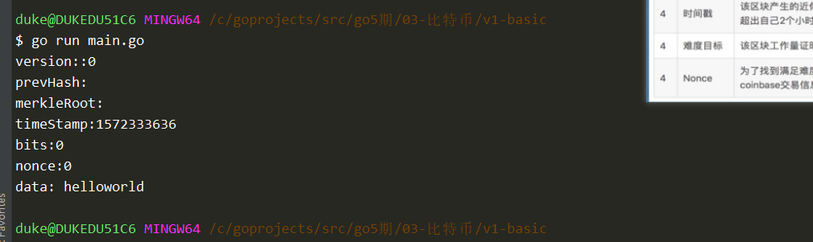
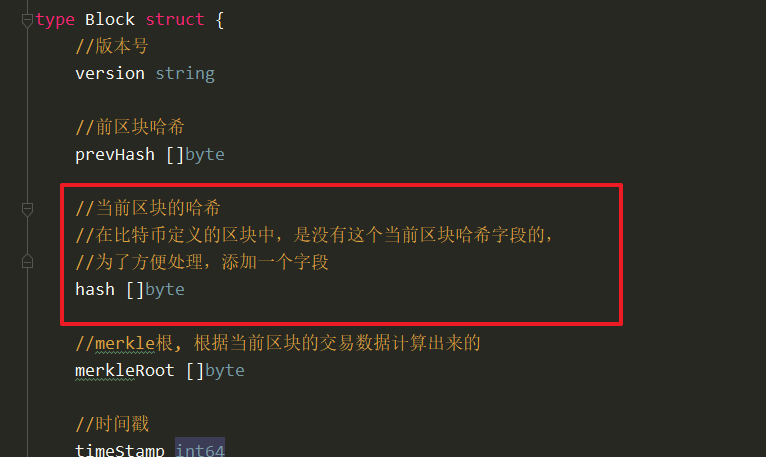
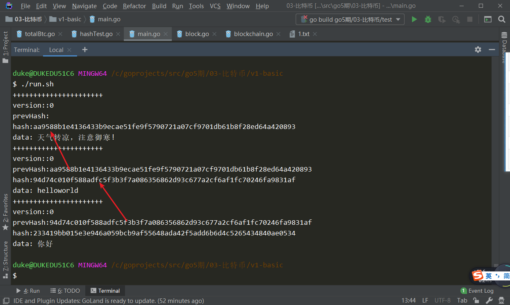
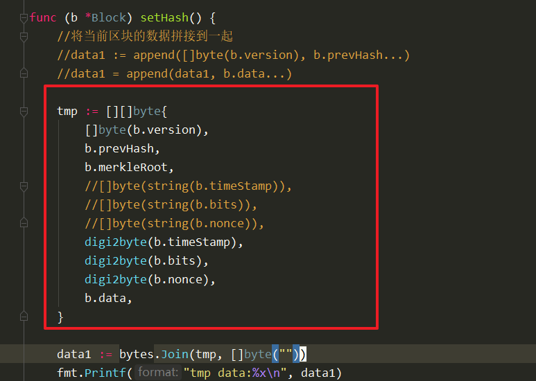
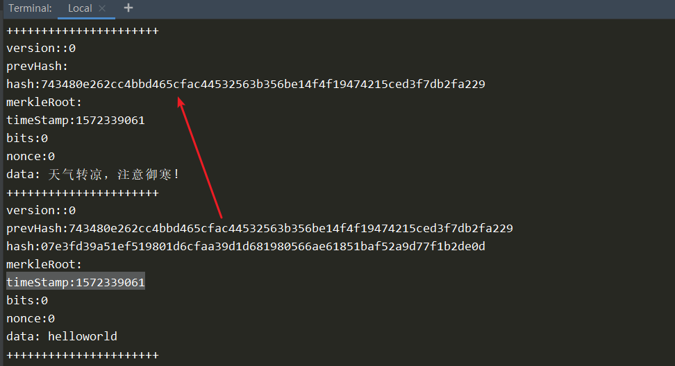

# 实现思路

1. 定义区块结构

2. 提供创建区块方法
3. 对当前区块求哈希值（并不会进行挖矿计算）
4. 定义区块链
5. 提供添加区块的方法
6. 打印区块链


# 定义区块，创建区块

```go
package main

import (
	"fmt"
	"time"
)

//定义区块结构
//区块头
//区块体
type Block struct {
	//版本号
	version string

	//前区块哈希
	prevHash []byte

	//merkle根, 根据当前区块的交易数据计算出来的
	merkleRoot []byte

	//时间戳
	timeStamp int64

	//难度值，系统提供的
	bits int64

	//随机数
	nonce int64

	//区块体，交易数据
	data []byte
}

func NewBlock(data string, prevHash []byte) *Block {
	block := &Block{
		version:    "0",
		prevHash:   prevHash,
		merkleRoot: nil,
		timeStamp:  time.Now().Unix(),
		bits:       0,
		nonce:      0,
		data:       []byte(data),
	}

	//挖矿过程暂且省略

	return block
}

func main() {
	block := NewBlock("helloworld", nil)

	fmt.Printf("version::%s\n", block.version)
	fmt.Printf("prevHash:%x\n", block.prevHash)
	fmt.Printf("merkleRoot:%x\n", block.merkleRoot)
	fmt.Printf("timeStamp:%d\n", block.timeStamp)
	fmt.Printf("bits:%d\n", block.bits)
	fmt.Printf("nonce:%d\n", block.nonce)
	fmt.Printf("data: %s\n", block.data)
}

```




增加hash字段




提供setHash方法

```go

func (b *Block) setHash() {
	//将当前区块的数据拼接到一起
	data1 := append([]byte(b.version), b.prevHash...)
	data1 = append(data1, b.data...)

	//哈希运算
	hash := sha256.Sum256(data1)
	b.hash = hash[:]
}

```

调用setHash


测试！


# 定义区块链，并创建

blockchain.go

```go
package main

type BlockChain struct {
	blocks []*Block
}

const genesisInfo = "天气转凉，注意御寒!"

//创建blockchain，同时添加一个创世块
func NewBlockChain() *BlockChain {
	genesisBlock := NewBlock(genesisInfo, nil)
	return &BlockChain{
		blocks: []*Block{genesisBlock},
	}
}

//添加区块的方法

```


# 实现AddBlock方法

```go

//1 <- 2 <-3
//添加区块的方法
func (bc *BlockChain) AddBlock(data string) {
	lastBlock := bc.blocks[len(bc.blocks)-1]
	prevHash := lastBlock.hash

	//1. 创建新的区块
	newBlock := NewBlock(data, prevHash)

	//2. 添加到bc的blocks
	bc.blocks = append(bc.blocks, newBlock)
}

```


main.go


效果：




# 写一个函数digi2Byte

utils.go

```go
package main

import (
	"bytes"
	"encoding/binary"
	"fmt"
)

//数字转成[]byte
func digi2byte(num int64) []byte {
	var buf bytes.Buffer
	err := binary.Write(&buf, binary.LittleEndian, &num)
	if err != nil {
		fmt.Println("binary.Write err:", err)
		return nil
	}

	return buf.Bytes()
}
```

test/joinTest.go

```go
package main

import (
	"bytes"
	"fmt"
	"strings"
)

func main() {
	str := []string{"hello", "world", "!"}
	res := strings.Join(str, "=")
	fmt.Println("res:", res)

	bytes1 := [][]byte{
		[]byte("hello"),
		[]byte("world"),
		[]byte("!"),
	}

	b1 := bytes.Join(bytes1, []byte(""))
	fmt.Printf("b1 :%s\n", b1)
}

```

改写setHash函数：




#  打印所有字段

main.go

```go
package main

import (
	"fmt"
)

func main() {
	bc := NewBlockChain()
	bc.AddBlock("helloworld")
	bc.AddBlock("你好")

	for _, block := range bc.blocks {
		fmt.Println("++++++++++++++++++++++")
		fmt.Printf("version::%s\n", block.version)
		fmt.Printf("prevHash:%x\n", block.prevHash)
		fmt.Printf("hash:%x\n", block.hash)
		fmt.Printf("merkleRoot:%x\n", block.merkleRoot)
		fmt.Printf("timeStamp:%d\n", block.timeStamp)
		fmt.Printf("bits:%d\n", block.bits)
		fmt.Printf("nonce:%d\n", block.nonce)
		fmt.Printf("data: %s\n", block.data)
	}

}
```

效果：



