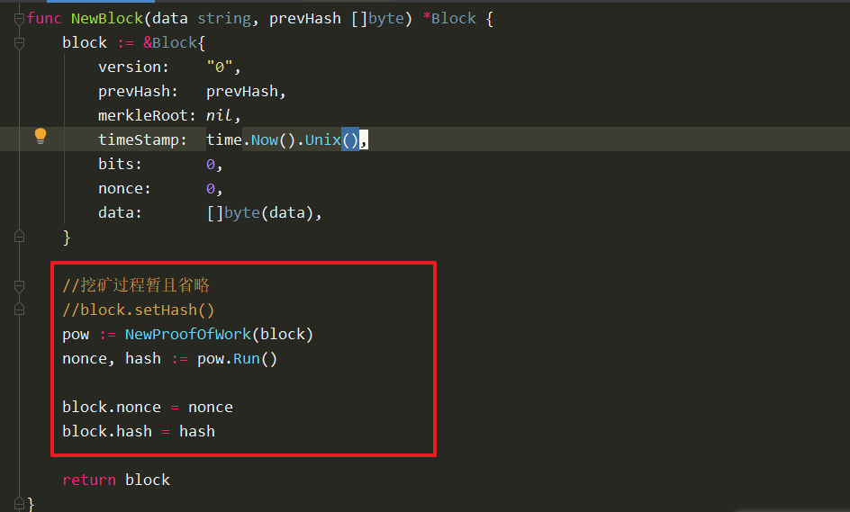
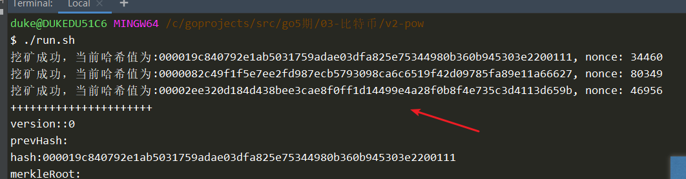
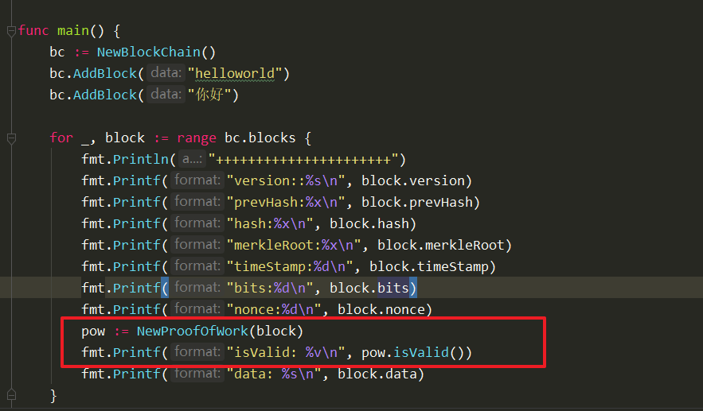

比特币挖矿：工作量证明（POW：Proof of work）

拿到结果，可以证明这个人做过某件事情


# 1. 定义一个结构（工作量证明）

定义一个结构：ProofOfWork，包含两个字段：

1. 区块数据block
2. 难度值target


绑定方法,负责计算nonce：

Run()，不断的尝试新的nonce，与block数据结合，计算哈希，与目标值对比


```go
package main

import "math/big"

//定义一个结构：ProofOfWork，包含两个字段：
type ProofOfWork struct {
	//1. 区块数据block
	block *Block

	//2. 难度值target
	target *big.Int
	//big.Int可以接受[]byte, string等数据类型，将其转换为big.Int类型
	//big.Int可以通过运算方法，Add,Cmp,Abs
}

//提供一个创建方法
func NewProofOfWork(block *Block) *ProofOfWork {
	pow := ProofOfWork{
		block: block,
	}

	//target系统自动调节出的一个数值，可以进一步推出一个哈希值
	targetStr := "0001000000000000000000000000000000000000000000000000000000000000"
	bigTmp := big.Int{}
	bigTmp.SetString(targetStr, 16)
	pow.target = &bigTmp

	return &pow
}

```


# 2. 挖矿函数逻辑分析

查找Nonce过程使用一个Run函数实现：

1. 实现数据的拼接（PrepareData函数）：
   1. 原有的区块数据
   2. Nonce


2. 使用一个for循环，不断改变Nonce值得到哈希值
3. 将哈希值转换成big.Int类型，与目标值比较
4. 找到了：直接返回哈希和Nonce
5. 没找到：Nonce++


# PrepareData

```go
func (pow *ProofOfWork) prepareData(nonce int64) []byte {
	b := pow.block

	tmp := [][]byte{
		[]byte(b.version),
		b.prevHash,
		b.merkleRoot,
		digi2byte(b.timeStamp),
		digi2byte(b.bits),
		digi2byte(nonce), //<<<<===== 注意修改，要使用传递进来的nonce
		b.data,
	}

	data := bytes.Join(tmp, []byte(""))

	return data
}
```


# Run函数实现

```go
//核心函数，不断改变Nonce，求出满足条件的哈希值
func (pow *ProofOfWork) Run() (int64, []byte) {

	var nonce int64
	var hash [32]byte

	for {
		fmt.Printf("挖矿中:%x\r", hash)
		//拼好的数据
		data := pow.prepareData(nonce)

		//计算哈希值
        hash = sha256.Sum256(data)

		//转换成big.Int
		tmpInt := big.Int{}
		tmpInt.SetBytes(hash[:])

		//比较
		//   -1 if x <  y
		//    0 if x == y
		//   +1 if x >  y
		//func (x *Int) Cmp(y *Int) (r int)
		if tmpInt.Cmp(pow.target) == -1 {
			fmt.Printf("挖矿成功，当前哈希值为:%x, nonce: %d\n", hash, nonce)
			break
		} else {
			//fmt.Printf("当前哈希为:%x ,nonce:%d\n", hash, nonce)
			nonce++
		}
	}

	return nonce, hash[:]
}

```


block中调用：




效果：




# 其他矿工验证区块

```go
//提供校验区块Nonce有效性函数
func (pow *ProofOfWork) isValid() bool {
	//1. 拼接数据
	data := pow.prepareData(pow.block.nonce)
	//2. 计算哈希
	currentHash := sha256.Sum256(data)
	tmpInt := big.Int{}
	tmpInt.SetBytes(currentHash[:])

	////3. 比较结果（仅进行一次计算)
	//if tmpInt.Cmp(pow.target) == -1 {
	//	return true
	//}
	//return false

	//或者
	return tmpInt.Cmp(pow.target) == -1
}

```


在main.go中调用：

