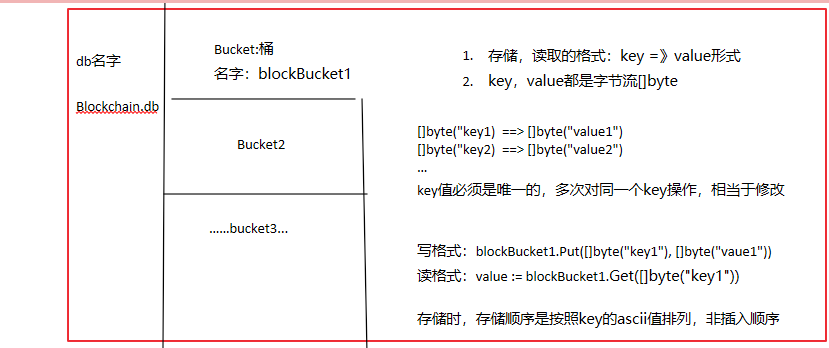
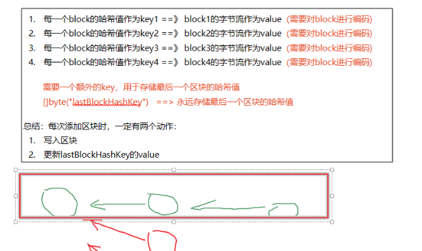
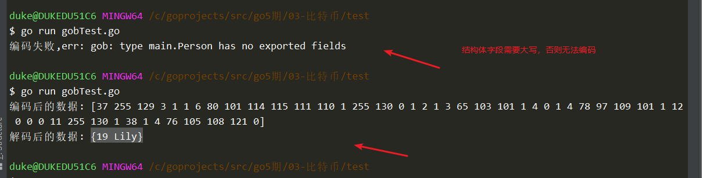
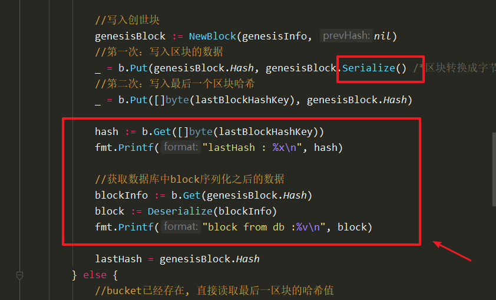
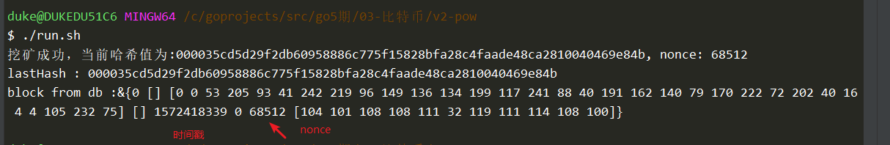
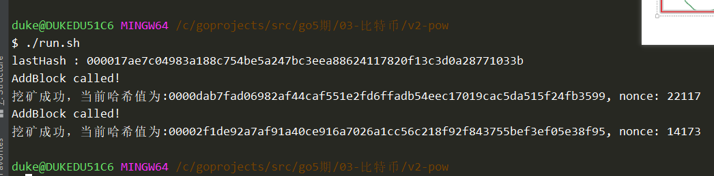
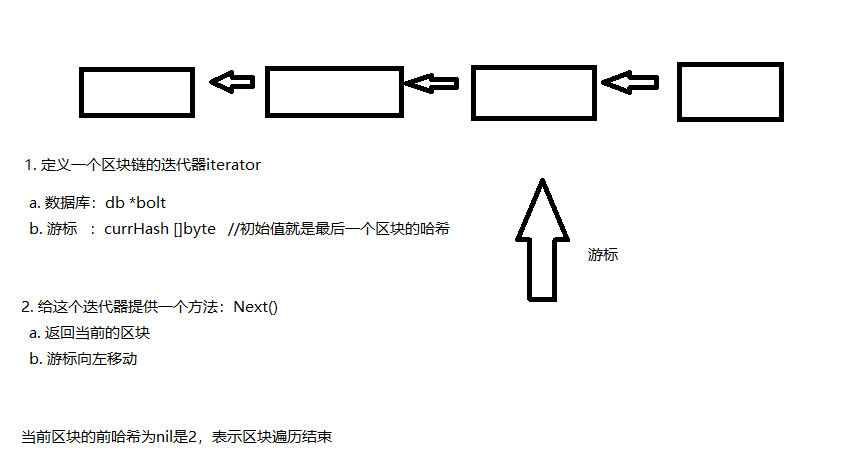
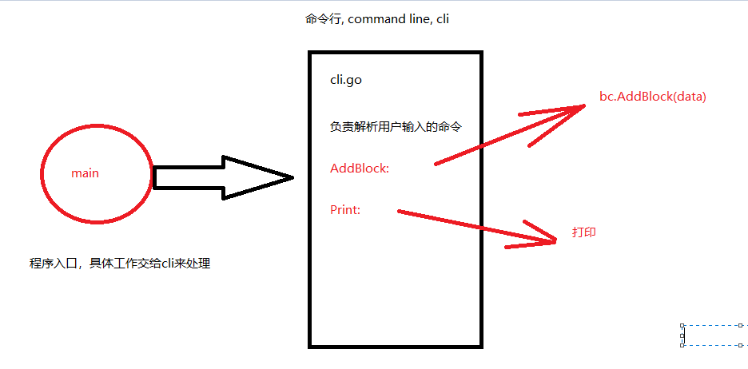
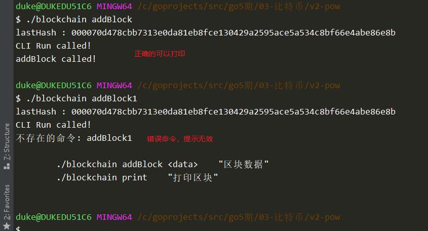
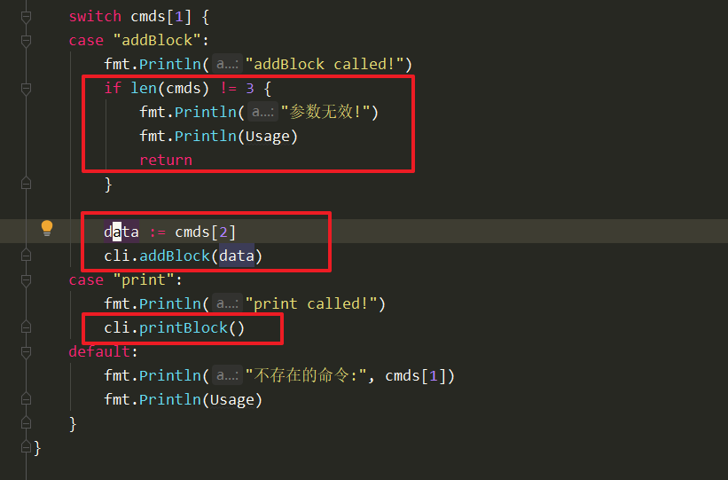

# 当前存在问题

1. 问题1：每次执行之后，内存释放，区块消失
   1. 解决：使用数据库存储（bolt数据库，key=》value形式的，没有sql语句，go语言实现的）
   2. 轻量，高效
2. 问题2：不灵活，每次添加区块时，都需要在main完成（修改代码）
   1. 解决：使用命令行来动态添加
   2. 使用go语言自带的命令行解析包：os.Args


# Bolt介绍

>  go get -t github.com/boltdb/bolt





# Bolt Demo

```go
package main

import (
	"fmt"
	"github.com/boltdb/bolt"
)

func main() {
	//打开数据库
	//func Open(path string, mode os.FileMode, options *Options) (*DB, error) {
	db, err := bolt.Open("test.db", 0600, nil /*超时相关配置*/)
	if err != nil {
		fmt.Println("bolt.Open err:", err)
		return
	}

	defer db.Close()

	//打开桶，Bucket, 如果没有桶，则需要手动创建
	db.Update(func(tx *bolt.Tx) error {

		//尝试打开一个bucket
		b := tx.Bucket([]byte("blockBucket"))

		if b == nil {
			//当前的bucket不存在，需要创建
			b, err = tx.CreateBucket([]byte("blockBucket"))
			if err != nil {
				fmt.Println(" tx.CreateBucket err:", err)
				return err
			}
		}

		//此时b一定是非nil的
		//添加
		_ = b.Put([]byte("key1"), []byte("hello"))
		_ = b.Put([]byte("key2"), []byte("world"))
		_ = b.Put([]byte("key2"), []byte("WORLD")) //覆盖

		//读取
		v1 := b.Get([]byte("key1"))
		v2 := b.Get([]byte("key2"))
		v3 := b.Get([]byte("key3")) //返回空值

		fmt.Println("v1:", string(v1))
		fmt.Println("v2:", string(v2))
		fmt.Println("v3:", string(v3))

		return nil
	})
}

```

效果：

```sh

duke@DUKEDU51C6 MINGW64 /c/goprojects/src/go5期/03-比特币/test
$ go run boltTest.go
v1: hello
v2: WORLD
v3:
```


# bolt与BlockChain结合设计分析



# 改写BlockChain，NewBlockChain分析

```go

type BlockChain struct {
	db   *bolt.DB //句柄，数据库对象handler
	tail []byte   //存储最后一个区块哈希值
}

const genesisInfo = "天气转凉，注意御寒!"
const blockChainFileName = "blockchain.db"
const blockBucket = "blockBucket"
const lastBlockHashKey = "lastBlockHashKey"

//创建blockchain，同时添加一个创世块
func NewBlockChain() *BlockChain {
	var lastHash []byte

	//创建区块链时，向里面写入一个创世快
	//包含两个功能：
	//1. 如果区块链不存在，则创建，写入创世快
	db, err := bolt.Open(blockChainFileName, 0600, nil)
	if err != nil {
		fmt.Println("创建区块链失败, err:", err)
		return nil
	}

	_ = db.Update(func(tx *bolt.Tx) error {
		b := tx.Bucket([]byte(blockBucket))

		if b == nil {
			//创建bucket
			b, err = tx.CreateBucket([]byte(blockBucket))
			if err != nil {
				fmt.Println("创建bucket失败, err:", err)
				return err
			}

			//写入创世块
			genesisBlock := NewBlock(genesisInfo, nil)
			//第一次：写入区块的数据
			_ = b.Put(genesisBlock.hash, genesisBlock.toByte() /*区块转换成字节流*/)
			//第二次：写入最后一个区块哈希
			_ = b.Put([]byte(lastBlockHashKey), genesisBlock.hash)

			lastHash = genesisBlock.hash
		} else {
			//bucket已经存在, 直接读取最后一区块的哈希值
			lastHash = b.Get([]byte(lastBlockHashKey))
		}

		return nil
	})
	//2. 如果区块链存在，获取最后一个区块的哈希值

	//拼接成BlockChain实例返回

	return &BlockChain{db: db, tail: lastHash}
}

```


# gob编解码

类似于protobuf的处理过程：

1. 序列化

   结构=》编码 =》字节流

2. 反序列化

   字节流=》解码=》结构


gob包，是纯服务于go程序的编码解码包，并非跨语言。

对任何类型都可以编码。


demo:

```go
package main

import (
	"bytes"
	"encoding/gob"
	"fmt"
)

type Person struct {
	Age  int
	Name string
}

func main() {
	p1 := Person{
		Age:  19,
		Name: "Lily",
	}

	//编码
	//1. 创建一个编码器
	var buf bytes.Buffer
	encoder := gob.NewEncoder(&buf)
	//2. 编码
	err := encoder.Encode(&p1)
	if err != nil {
		fmt.Println("编码失败,err:", err)
		return
	}

	fmt.Println("编码后的数据:", buf.Bytes())

	//.....

	//解码
	p2 := Person{}

	//1. 创建一个解码器
	decoder := gob.NewDecoder(bytes.NewReader(buf.Bytes()))

	//2. 解码
	err = decoder.Decode(&p2)
	if err != nil {
		fmt.Println("解码失败, err:", err)
		return
	}

	fmt.Println("解码后的数据:", p2)
}
```

效果：




# 给Block结构绑定方法(序列化)

block.go中，增加如下方法：

```go
//序列化区块
//结构=》编码 =》字节流
func (b *Block) Serialize() []byte {
	//创建编码器
	var buff bytes.Buffer
	encoder := gob.NewEncoder(&buff)
	//编码
	err := encoder.Encode(b)
	if err != nil {
		fmt.Println("区块编码失败, err:", err)
		return nil
	}
	return buff.Bytes()
}

//反序列化区块
//字节流=》解码=》结构
func Deserialize(data []byte) *Block {
	var block Block
	//创建解码器
	decoder := gob.NewDecoder(bytes.NewReader(data))

	//解码
	err := decoder.Decode(&block)
	if err != nil {
		fmt.Println("区块解析字节流失败,err:", err)
		return nil
	}
	return &block
}
```


# 序列化集成到程序

将Block中的字段修改为大写字母开头，否则无法进行gob编码。





修改主函数：

```go
func main() {
	bc := NewBlockChain()
	defer bc.db.Close()  //<<======增加
	bc.AddBlock("helloworld")
	bc.AddBlock("你好")
}
```


效果：




# AddBlock

添加区块：

```go
//1 <- 2 <-3
//添加区块的方法
func (bc *BlockChain) AddBlock(data string) {
	fmt.Println("AddBlock called!")
	//最后一个区块的哈希值
	lastHash := bc.tail

	//1. 创建新的区块
	newBlock := NewBlock(data, lastHash)

	bc.db.Update(func(tx *bolt.Tx) error {
		b := tx.Bucket([]byte(blockBucket))
		if b == nil {
			log.Fatal("AddBlock是，bucket不应为空!")
		}

		//写入区块
		_ = b.Put(newBlock.Hash, newBlock.Serialize())
		_ = b.Put([]byte(lastBlockHashKey), newBlock.Hash)

		//更新tail的值
		bc.tail = newBlock.Hash //<<<=== 不要忘记
		return nil
	})
}
```


效果：




# 迭代器介绍

```go
numbers := []int{1,2,3,4,5}

for i, v := range numbers {
    //i, v
}
```





# 定义迭代器

```go
package main

import "github.com/boltdb/bolt"

type Iterator struct {
	db       *bolt.DB
	currHash []byte //当前区块的哈希，会不断变化
}

func NewIterator(bc *BlockChain) *Iterator {
	return &Iterator{
		db:       bc.db,
		currHash: bc.tail,
	}
}

//会多次调用这个方法，每次调用时
//1. 会返回当前位置的区块
//2. 游标currHash 会指向前一个区块
func (it *Iterator) Next() *Block {
	//TODO
	return nil
}
```

搭建框架：

main.go

```go
package main

import "fmt"

func main() {
	bc := NewBlockChain()
	defer bc.db.Close()
	bc.AddBlock("helloworld")
	bc.AddBlock("你好")

	it := NewIterator(bc)  //<<===========

	for {
		block := it.Next()   //<<===========
		fmt.Println("++++++++++++++++++++++")
		fmt.Printf("version::%s\n", block.Version)
		fmt.Printf("prevHash:%x\n", block.PrevHash)
		fmt.Printf("hash:%x\n", block.Hash)
		fmt.Printf("merkleRoot:%x\n", block.MerkleRoot)
		fmt.Printf("timeStamp:%d\n", block.TimeStamp)
		fmt.Printf("bits:%d\n", block.Bits)
		fmt.Printf("nonce:%d\n", block.Nonce)
		pow := NewProofOfWork(block)
		fmt.Printf("isValid: %v\n", pow.isValid())
		fmt.Printf("data: %s\n", block.Data)

		//判断是否已经是创世块
		if block.PrevHash == nil {
			break
		}
	}
	fmt.Println("区块链遍历结束!")
}

```


# 实现Next方法

```go
//会多次调用这个方法，每次调用时
//1. 会返回当前位置的区块
//2. 游标currHash 会指向前一个区块
func (it *Iterator) Next() *Block {
	var block *Block
	it.db.View(func(tx *bolt.Tx) error {
		//获取bucket
		b := tx.Bucket([]byte(blockBucket))
		if b == nil {
			log.Fatal("Iterator Next时，bucket不应为空!")
		}

		//获取区块
		blockInfo := b.Get(it.currHash)
		block = Deserialize(blockInfo)

		//游标左移
		it.currHash = block.PrevHash

		return nil
	})

	return block
}

```


测试：

略


# os.Args

创建，argsTest.go：

```go
package main

import (
	"fmt"
	"os"
)

func main() {
	cmds := os.Args

	for i, v := range cmds {
		fmt.Println("i:", i, ", v:", v)
	}
}

```

go build -o argsTest.exe argsTest.go

> duke@DUKEDU51C6 MINGW64 /c/goprojects/src/go5期/03-比特币/test
> $ ./argsTest.exe hello world
> i: 0 , v: C:\goprojects\src\go5期\03-比特币\test\argsTest.exe
> i: 1 , v: hello
> i: 2 , v: world


# 命令行分析




# 创建cli.go文件

```go
package main

import (
	"fmt"
	"os"
)

//定义一个CLI结构
type CLI struct {
	bc *BlockChain
}

const Usage = `
	./blockchain addBlock <data>    "区块数据"
	./blockchain print    "打印区块"
`

//持续解析命令的方法
func (cli *CLI) Run() {
	fmt.Println("CLI Run called!")

	cmds := os.Args

	if len(cmds) < 2 {
		fmt.Println("输入参数无效，请检查!")
		fmt.Println(Usage)
		return
	}

	//解析命令
	switch cmds[1] {
	case "addBlock":
		fmt.Println("addBlock called!")
		//TODO
	case "print":
		fmt.Println("print called!")
		//TODO
	default:
		fmt.Println("不存在的命令:", cmds[1])
		fmt.Println(Usage)
	}
}

```


修改main.go

```go
package main

func main() {
	bc := NewBlockChain()
	defer bc.db.Close()
	cli := CLI{bc}
	cli.Run()
}
```


修改run.sh

```go
#!/bin/bash
rm *.db
go build -o blockchain *.go
./blockchain
```


效果：




# cli调度具体的业务逻辑

创建commandline.go文件，里面实现两个方法

```go
package main

import "fmt"

func (cli *CLI) addBlock(data string) {
	cli.bc.AddBlock(data)
}

func (cli *CLI) printBlock() {
	it := NewIterator(cli.bc)

	for {
		block := it.Next()

		fmt.Println("++++++++++++++++++++++")
		fmt.Printf("version::%s\n", block.Version)
		fmt.Printf("prevHash:%x\n", block.PrevHash)
		fmt.Printf("hash:%x\n", block.Hash)
		fmt.Printf("merkleRoot:%x\n", block.MerkleRoot)
		fmt.Printf("timeStamp:%d\n", block.TimeStamp)
		fmt.Printf("bits:%d\n", block.Bits)
		fmt.Printf("nonce:%d\n", block.Nonce)
		pow := NewProofOfWork(block)
		fmt.Printf("isValid: %v\n", pow.isValid())
		fmt.Printf("data: %s\n", block.Data)

		//判断是否已经是创世块
		if block.PrevHash == nil {
			break
		}
	}
	fmt.Println("区块链遍历结束!")
}

```


在CLI 的Run函数中调用：




测试：

```sh
$ ./blockchain addBlock "天气1"
lastHash : 000049ec9b23b1d540ebf2f5aaf89a205fedd5e1486cf352cb85a5d0f5c1ba69
CLI Run called!
addBlock called!
AddBlock called!
挖矿成功，当前哈希值为:0000901e640f26d183284f3c6c15e9d4bfc2dd57dd5acc6e3635c


duke@DUKEDU51C6 MINGW64 /c/goprojects/src/go5期/03-比特币/v2-pow
$ ./blockchain print

```

