在传统银行中，每一个账户都会有一个对应的数据表，

里面有一个字段记录A的总额，当A进行转账时，只需要修改这个字段的数据即可。


在比特币中，A=》B转账时，并不是修改一个字段，因为比特币的交易数据一旦写入账本之后，是不可以被修改的。

比特币是通过找零机制来完成转账功能的：

A总共有500个比特币（假设是一笔交易的金额）

A=》B 转账100

比特币会将500个比特币全部花费掉，转100个给B，转400个给A，比特币账本中，A原来的500个就作废了。

此时，我们没有修改原来交易中的数据（没有修改，但是系统中会有方式标识出这500个已经被消耗了）

同时，转账完成。


张三：1000元总额。

由10张100元面值组成

1. 工作400（区块10==》第 1条交易）
2. 理财300（区块20 ==》 第三条交易）
3. 副业300（区块50 ==》 第20条交易）


在比特币账本中，有三笔交易记录着张三的钱。

在比特币中，是没有一个字段来存储某个地址的总额的。

比特币通过遍历整个账本，去查询所有自己的私钥能够支配的零散的钱

进行交易时，比特系统会自动找到一个合理的钱


比特币中，接收转账使用的是地址。

A=》B转账,

需要A的私钥对A能够支配的钱进行`解锁`

需要使用B的`公钥的哈希`进行`锁定`


B: 私钥=》公钥=》公钥哈希《=》地址


# 地址

[在线生成地址](http://gobittest.appspot.com/Address)

[BitCoinAddress](https://www.bitaddress.org/bitaddress.org-v3.3.0-SHA256-dec17c07685e1870960903d8f58090475b25af946fe95a734f88408cef4aa194.html)(生成真实可用的地址)


1. 使用私钥PrivKey ==》获取公钥pubKey
2. 对公钥进行两次哈希处理：=》==公钥哈希pubKeyHash==
   1. sha256(pubKey)
   2. 第二次做ripemd160哈希处理，160位， 20字节

3. 再在公钥哈希前面加上一个字节的版本号。（当前网络版本号），得到payload，21字节
   1. 主网：0x00
   2. 测试：
4. 对拼好21字节数据做两次sha256,截取前4字节，得到checksum，即4字节的校验码。=》得到25字节的数据
5. 对25字节数据进行base58处理，得到地址


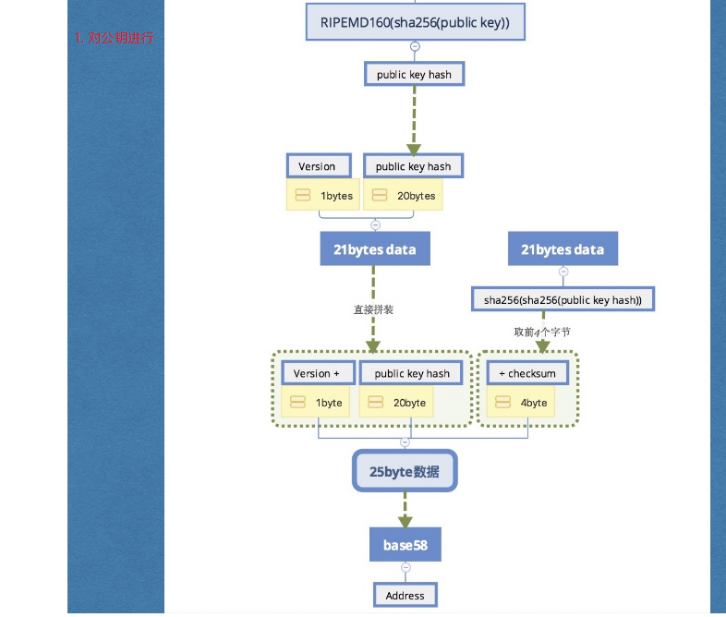


1私钥 =》1地址

1root privete =》 Son private =》 孙私钥

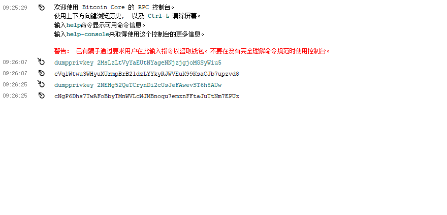


# 两个脚本

交易输入：

1. 付款人的多笔钱的来源（100 + 50）

2. 一个或者多个

交易输出：

1. 一个或者多个


解锁脚本：

1. 需要提供付款方的私钥签名和公钥


锁定脚本：

1. 收款方的地址（公钥哈希）


每一个input都会有一个解锁脚本：描述付款方可以使用这笔钱

麽易output都会有一个锁定脚本：描述收款方对这笔钱进行锁定。


# 解锁过程分析


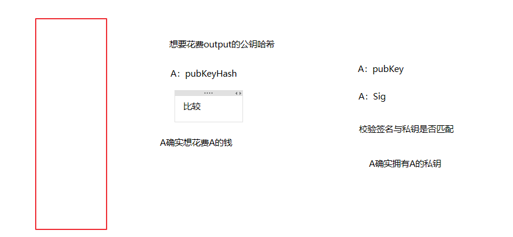


# 交易结构

1. 交易输入：（可以有多个）
   1. 所引用的output所在的交易id
   2. 所引用的output的索引值
   3. 解锁脚本：
      1. 私钥签名
      2. 公钥
2. 交易输出：（可以有多个）
   1. 锁定脚本
   2. 接收金额
3. 时间戳：timestamp
4. 交易id：每个交易都是唯一的，我们使用当前交易的哈希值来代表（tx：Transaction）


# 交易结构定义

```go
package main

import (
	"bytes"
	"crypto/sha256"
	"encoding/gob"
	"fmt"
	"time"
)

//交易结构
type Transaction struct {
	//交易ID
	Txid []byte

	//多个交易输入
	TxInputs []TXInput

	//多个交易输出
	TXOutputs []TXOutput

	//时间戳
	TimeStamp int64
}

//交易输入
type TXInput struct {
	//1. 所引用的output所在的交易id
	TXID []byte
	//2. 所引用的output的索引值
	Index int64
	//3. 解锁脚本：
	ScriptSig string //先使用string代替，后续会改成签名
	//1. 私钥签名
	//2. 公钥
}

//交易输出
type TXOutput struct {
	//1. 锁定脚本
	LockScript string
	//2. 转账金额
	Value float64
}
```


# 获取交易ID

```go
//设置当前交易的id，使用交易本身的哈希值作为自己交易id
func (tx *Transaction) SetTxId() {
	var buff bytes.Buffer

	encoder := gob.NewEncoder(&buff)
	err := encoder.Encode(tx)
	if err != nil {
		fmt.Println("设置交易id失败, err:", err)
		return
	}

	hash := sha256.Sum256(buff.Bytes())

	tx.Txid = hash[:]
}
```


# 创建挖矿交易

```go
const reward = 12.5

//挖矿交易
//没有引用的输入, 只有输出，只有一个output
func NewCoinbaseTx(miner string, data string) *Transaction {
	intputs := []TXInput{{
		TXID:      nil,
		Index:     -1,
		ScriptSig: data,
	}}

	outputs := []TXOutput{{
		LockScript: miner,
		Value:      reward,
	}}

	tx := &Transaction{
		TxInputs:  intputs,
		TXOutputs: outputs,
		TimeStamp: time.Now().Unix(),
	}

	//设置交易id
	tx.SetTxId()

	return tx
}

//普通交易
func NewTransaction() *Transaction {
	//TODO
	return nil
}
```


# 我有多少个比特币？

每一个交易都会产生交易输出output，这个output可以作为后续交易的输入。

如果这个output还没有被其他交易引用，那么它有一个专门的名字：未消费交易输出（Unspent TX Output），UTXO


一个地址的总额，就是遍历账本，查询这个地址锁定的UTXO所包含的Value总和。


# 使用Transaction改写程序

1.改写block字段

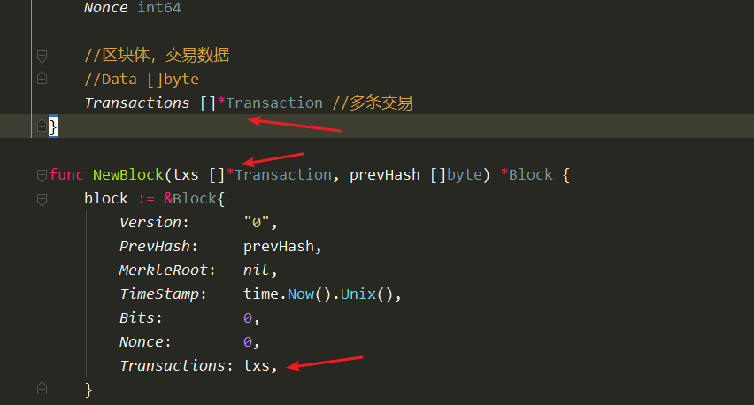


//num:= []int{1,2,3,4}

2.blockchain.go改写NewBlockchain函数

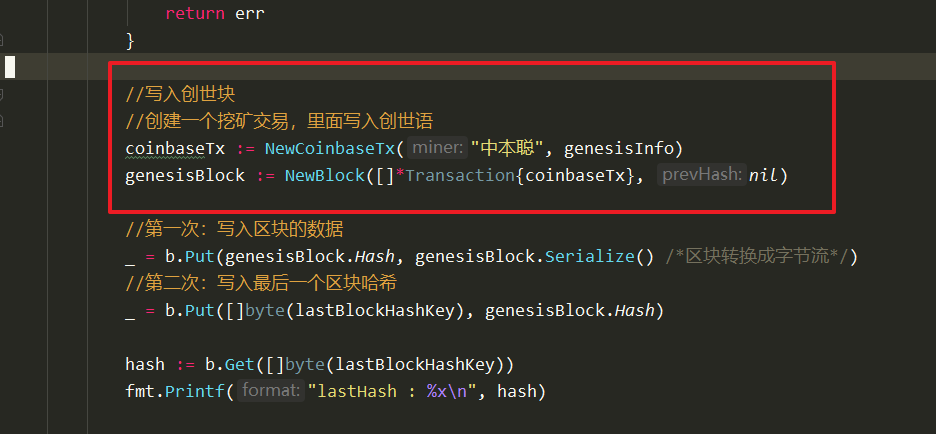


3.AddBlock修改

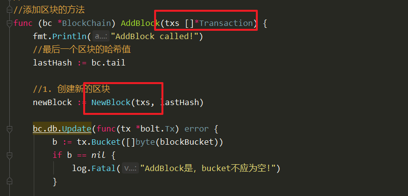


4.commandline.go

```sh
func (cli *CLI) addBlock(data string) {
	//cli.bc.AddBlock(data) //TODO  <<===注释
}
```


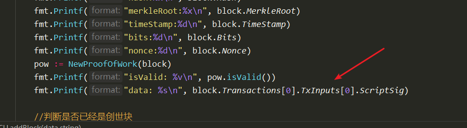


5.proofofwork.go

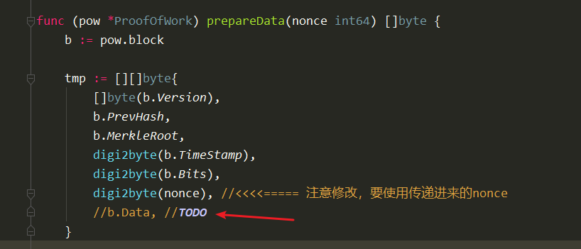


测试


# 获取挖矿人金额

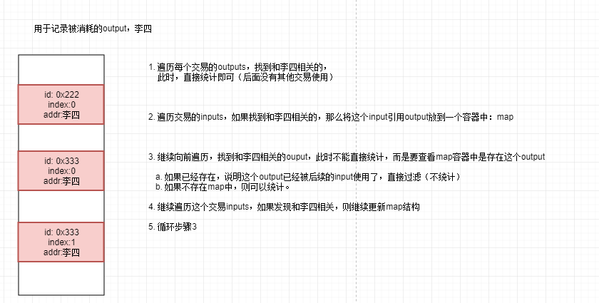


# 遍历交易(只有outputs)

blockchain.go

```go
//遍历账本，查询指定地址所有的utxo
func (bc *BlockChain) FindMyUtxo(address string) []TXOutput {
	fmt.Println("FindMyUtxo called, address:", address)

	var outputs []TXOutput

	//1. 遍历区块
	it := NewIterator(bc)

	for {
		block := it.Next()
		//2. 遍历交易
		for _, tx := range block.Transactions {
			//3. 遍历output
			for outputIndex, output := range tx.TXOutputs {
				//判断当前的output是否是目标地址锁定的
				if output.LockScript == address {
					fmt.Printf("找到了属于'%s'的output, index:%d, value:%f\n", address, outputIndex, output.Value)
					outputs = append(outputs, output)
				}
			}

			//遍历inputs， 得到一个map
            //TODO
		}

		if block.PrevHash == nil {
			break
		}
	}

	return outputs
}
```


# 获取余额

在cli中增加命令

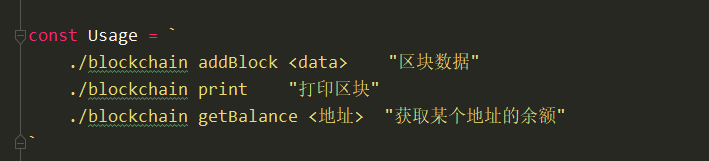


解析命令

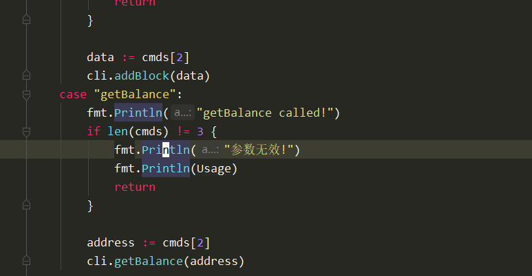


commandline.go实现

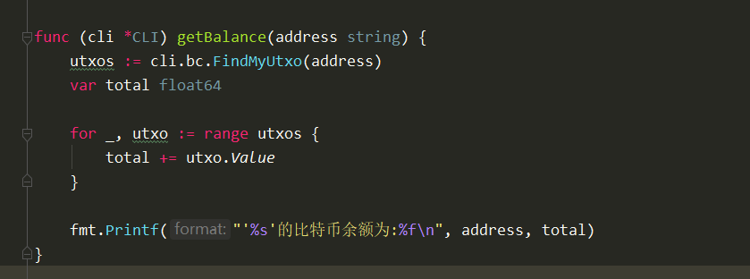


测试：

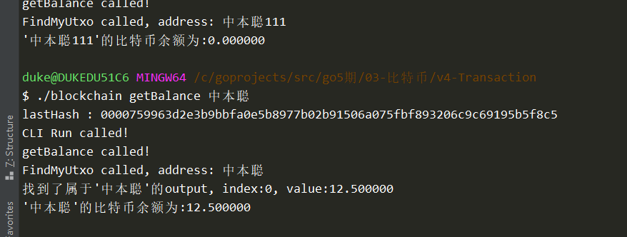


# 遍历inputs

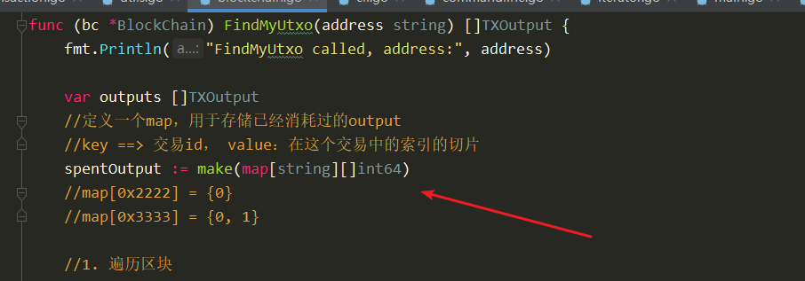


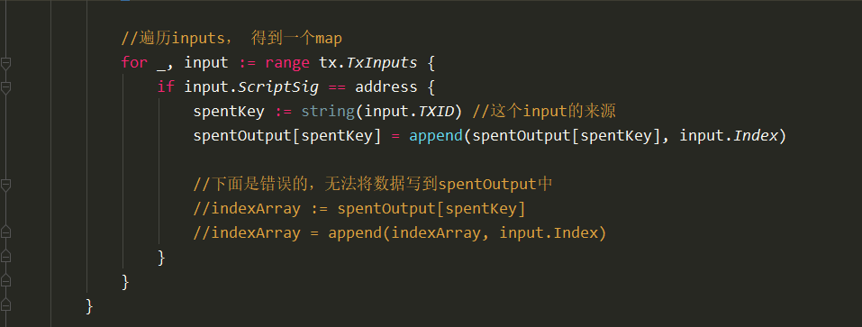


# 在添加output前进行过滤判断

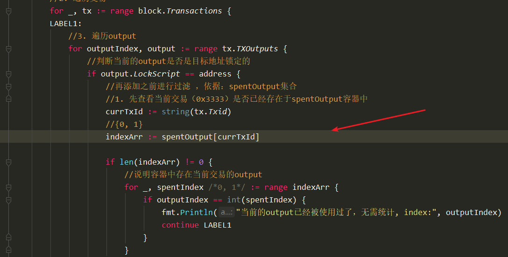


完整代码：

```go
//遍历账本，查询指定地址所有的utxo
func (bc *BlockChain) FindMyUtxo(address string) []TXOutput {
	fmt.Println("FindMyUtxo called, address:", address)

	var outputs []TXOutput
	//定义一个map，用于存储已经消耗过的output
	//key ==> 交易id， value：在这个交易中的索引的切片
	spentOutput := make(map[string][]int64)
	//map[0x2222] = {0}
	//map[0x3333] = {0, 1}

	//1. 遍历区块
	it := NewIterator(bc)

	for {
		block := it.Next()
		//2. 遍历交易
		for _, tx := range block.Transactions {
		LABEL1:
			//3. 遍历output
			for outputIndex, output := range tx.TXOutputs {
				//判断当前的output是否是目标地址锁定的
				if output.LockScript == address {
					//再添加之前进行过滤 ，依据：spentOutput集合
					//1. 先查看当前交易（0x3333）是否已经存在于spentOutput容器中
					currTxId := string(tx.Txid)
					//{0, 1}
					indexArr := spentOutput[currTxId]

					if len(indexArr) != 0 {
						//说明容器中存在当前交易的output
						for _, spentIndex /*0, 1*/ := range indexArr {
							if outputIndex == int(spentIndex) {
								fmt.Println("当前的output已经被使用过了，无需统计, index:", outputIndex)
								continue LABEL1
                                //会直接跳到LABEL1，继续执行
							}
						}
					}
					//2. 如果不存在，则直接添加
					//3. 如果存在，进一步查看当前的output是否存在于这个容器//map[0x3333] = {0, 1}
					//	a. 获取这个交易id（0x333）对应的数组值indexArray : {0, 1}
					//  b. 判断当前索引是否属于{0, 1}

					fmt.Printf("找到了属于'%s'的output, index:%d, value:%f\n", address, outputIndex, output.Value)
					outputs = append(outputs, output)
				}
			}

			//遍历inputs， 得到一个map
			for _, input := range tx.TxInputs {
				if input.ScriptSig == address {
					spentKey := string(input.TXID) //这个input的来源
					spentOutput[spentKey] = append(spentOutput[spentKey], input.Index)

					//下面是错误的，无法将数据写到spentOutput中
					//indexArray := spentOutput[spentKey]
					//indexArray = append(indexArray, input.Index)
				}
			}
		}

		if block.PrevHash == nil {
			break
		}
	}

	return outputs
}
```


labelTest.go

```go
package main

import "fmt"

func main() {
	//nums := []int{1, 2, 3, 4, 5, 6, 7, 8, 9,}

LABEL1:
	for {
		fmt.Println("xxxxxxxxx")

		for i := 0; i < 9; i++ {
			if i == 5 {
				//continue LABEL1
				//goto LABEL1
				break LABEL1
			}
			fmt.Println("i:", i)
		}

		fmt.Println("YYYYYYYYY")
	}
}

```

