# 地址改写程序

1. 通过公钥， 获取公钥哈希
   1. getPubKeyHashFromPubKey(公钥)
2. 通过地址，获取公钥哈希
   1. getPubKeyHashFromAddress（地址）


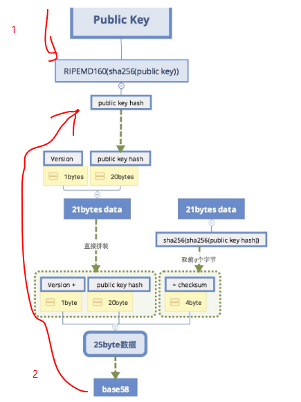


实现三个函数：

```go
//1. 通过公钥， 获取公钥哈希
func getPubKeyHashFromPubKey(pubKey []byte) []byte {
	//一、第一次哈希
	firstHash := sha256.Sum256(pubKey)
	//第二次哈希
	hasher := ripemd160.New()
	hasher.Write(firstHash[:])
	pubKeyHash := hasher.Sum(nil)

	return pubKeyHash
}

//2. 通过地址，获取公钥哈希
func getPubKeyHashFromAddress(address string) []byte {
	//1. base58解码，得到25字节数据
	decodeInfo := base58.Decode(address)

	if len(decodeInfo) != 25 {
		fmt.Println("地址长度无效, 应该为25字节，当前字节为:", len(decodeInfo))
		return nil
	}

	//2. 截取出中间的20字节
	pubKeyHash := decodeInfo[1:21]

	//3. 返回
	return pubKeyHash
}

func checkSum(payload []byte) []byte {
	f1 := sha256.Sum256(payload)
	second := sha256.Sum256(f1[:])

	//checksum := second[:] //作闭右开
	checksum := second[:4] //作闭右开
	return checksum
}

```


## 改写地址函数

```go
func (w *Wallet) getAddress() string {
	//通过公钥， 获取公钥哈希
	pubKeyHash := getPubKeyHashFromPubKey(w.PubKey)

	//二、在前面添加1个字节的版本号
	payload := append([]byte{byte(00)}, pubKeyHash...)

	//三、做两次哈希运算，截取前四个字节，作为checksum，
	checksum := checkSum(payload)

	//四、拼接25字节数据
	payload = append(payload, checksum...)

	//五、base58处理，得到地址
	address := base58.Encode(payload)
	return address
}

```


技巧：Ctrl+R，输入“cre”，此时会显出最近的含义cre开头的命令，

如果不是想要的，可以继续ctrl +R，此时会查找另外一个cre开头的命令。

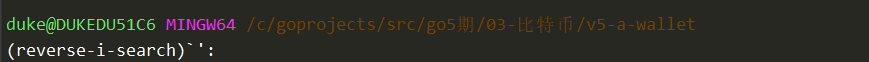


终端常用操作：

1. ctrl + a  => 移动到行首
2. ctrl + e => 移动到行尾


1. ctrl + f =》 向前移动一个字符
2. ctrl + b=》向后移动一个字符


1. ctrl + h=》向前删除一个字符
2. ctrl + d=》向后删除一个字符


1. ctrl + u =》 删除当前光标前的所有字符
2. ctrl + k=》 删除当前光标后的所有字符
3. ctrl + l =》 清屏


## 改写交易

```go
//交易输入
type TXInput struct {
	//1. 所引用的output所在的交易id
	TXID []byte
	//2. 所引用的output的索引值
	Index int64
	//3. 解锁脚本：
	//ScriptSig string //先使用string代替，后续会改成签名

	//1. 私钥签名
	ScriptSig []byte   <<====
	//2. 公钥
	PubKey []byte  <<====
}

//交易输出
type TXOutput struct {
	//1. 锁定脚本
	//LockScript string

	//1收款人的公钥哈希
	PubKeyHash []byte  <<====
	//2. 转账金额
	Value float64
}

```


提供NewTXOutput方法

```go
//收款人给付款人地址，锁定的时候不是使用地址锁定的，而是使用公钥哈希锁定的
//提供一个生成output的方法
func NewTXOutput(value float64, address string) TXOutput {
	//计算公钥哈希
	pubKeyHash := getPubKeyHashFromAddress(address)

	output := TXOutput{
		PubKeyHash: pubKeyHash,
		Value:      value,
	}

	return output
}
```


改写挖矿交易：

```go
func NewCoinbaseTx(miner string, data string) *Transaction {
	intputs := []TXInput{{
		TXID:      nil,
		Index:     -1,
		ScriptSig: []byte(data),  <<===
		PubKey:    nil, <<===
	}}

	output := NewTXOutput(reward, miner) <<===
	outputs := []TXOutput{output} <<===

	//outputs := []TXOutput{{
	//	LockScript: miner,
	//	Value:      reward,
	//}}

	tx := &Transaction{
		TxInputs:  intputs,
		TXOutputs: outputs,
		TimeStamp: time.Now().Unix(),
	}

	//设置交易id
	tx.SetTxId()

	return tx
}

```


改写NewTransaction

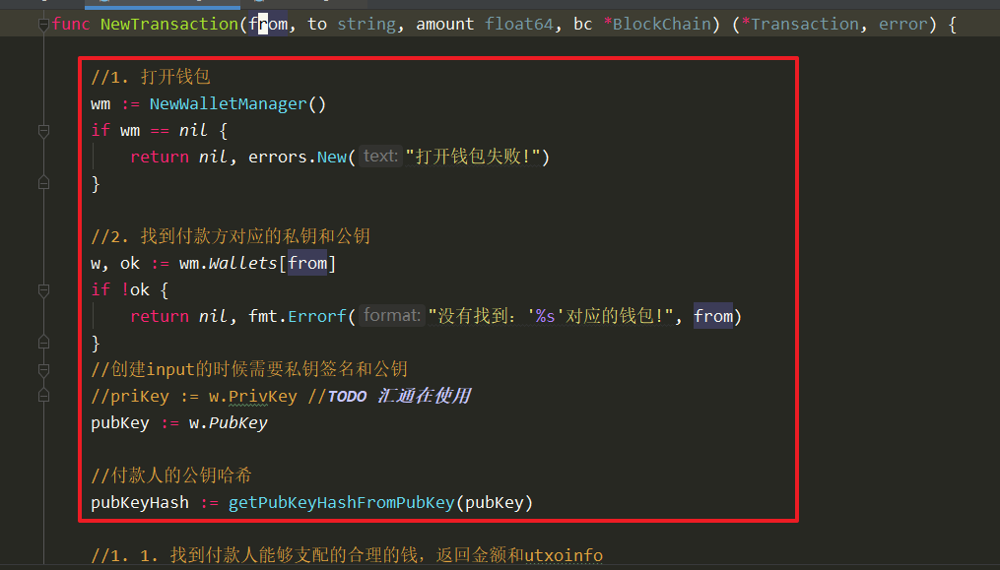


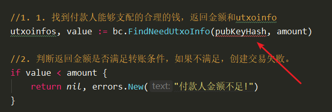


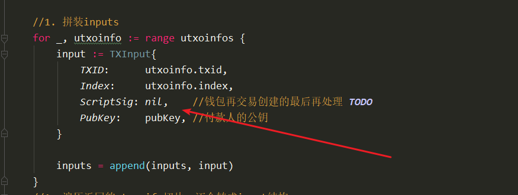


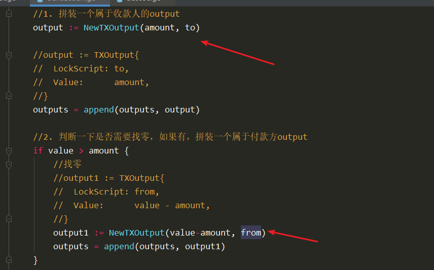


# 修改遍历函数

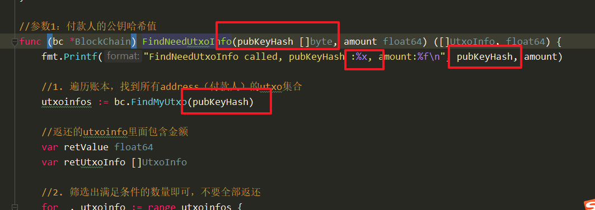


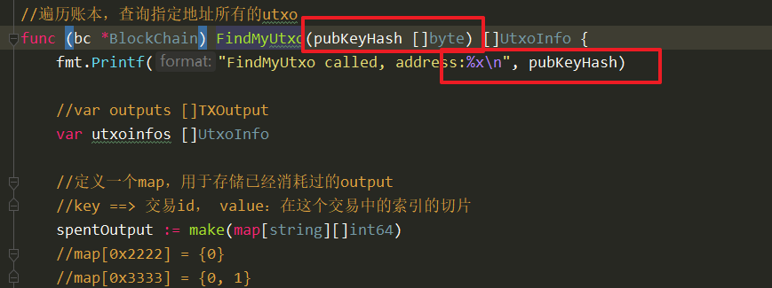


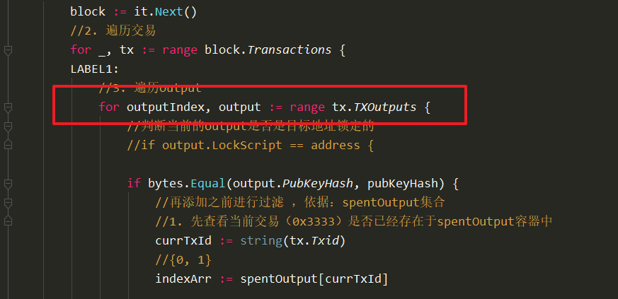


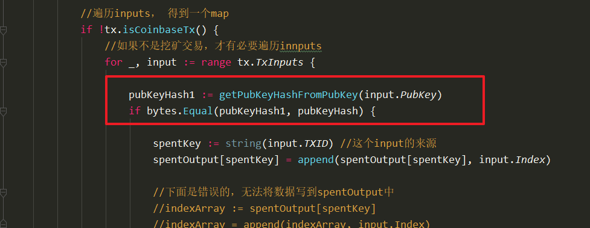


修改创世块地址：临时的

> 1Fakfxjba4LwEtNVUJnz9erXqjgBeRzvuz

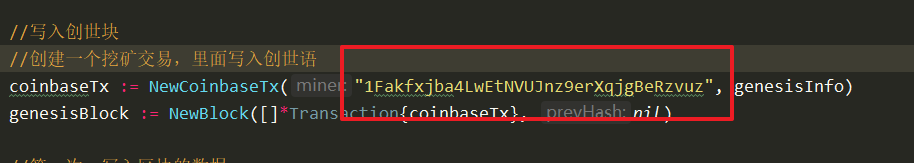


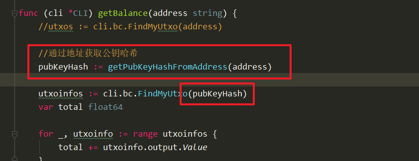


写脚本测试：check.sh

```go

#!/bin/bash

./blockchain send 1Fakfxjba4LwEtNVUJnz9erXqjgBeRzvuz 1CAu5rZtzWFYnN2KpMUWaN9LXhJ75H1eoX 10 19dpiTubN8ty2Ji5JTrTSpbUYMhnuuq888 "hello world"

./blockchain getBalance 1Fakfxjba4LwEtNVUJnz9erXqjgBeRzvuz #2.5
./blockchain getBalance 1CAu5rZtzWFYnN2KpMUWaN9LXhJ75H1eoX #10
./blockchain getBalance 19dpiTubN8ty2Ji5JTrTSpbUYMhnuuq888 #12.5

```

```sh

付款人：

address: 1Fakfxjba4LwEtNVUJnz9erXqjgBeRzvuz


收款人：

address: 1CAu5rZtzWFYnN2KpMUWaN9LXhJ75H1eoX

矿工：

address: 19dpiTubN8ty2Ji5JTrTSpbUYMhnuuq888
```


chmod.exe +x check.sh

./check.sh

效果：

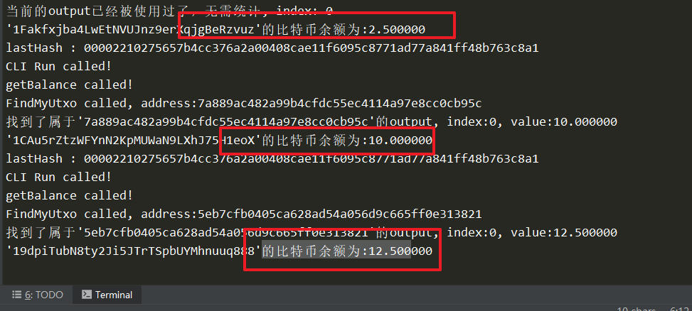


## 校验地址有效性

无效地址：19dpiTubN8ty2Ji5JTrTSpbUYMhnuuq887

有效地址：19dpiTubN8ty2Ji5JTrTSpbUYMhnuuq888


方法：

1. 对传入的地址解密=》得到25字节数据
2. 截取出前21byte，计算checksum，得到checksum1
3. 截取后4byte，得到checksum2
4. 比较checksum与checksum2，
   1. 相同：地址有效
   2. 不同：地址无效


代码实现， wallet.go中添加如下代码：

```go
func isValidAddress(address string) bool {
	//1. 对传入的地址解密=》得到25字节数据
	decodeInfo := base58.Decode(address)

	if len(decodeInfo) != payloadLen {
		return false
	}

	//2. 截取出前21byte，计算checksum，得到checksum1
	checksum1 := checkSum(decodeInfo[:payloadLen-checkSumLen])

	//3. 截取后4byte，得到checksum2
	checksum2 := decodeInfo[payloadLen-checkSumLen:]

	fmt.Printf("checksum1: %x\n", checksum1)
	fmt.Printf("checksum2: %x\n", checksum2)

	//4. 比较checksum与checksum2，
	return bytes.Equal(checksum1, checksum2)
	//1. 相同：地址有效
	//2. 不同：地址无效

}
```


在commandline.go调用：

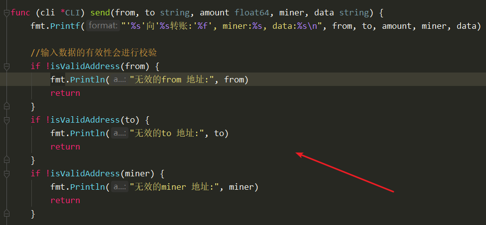


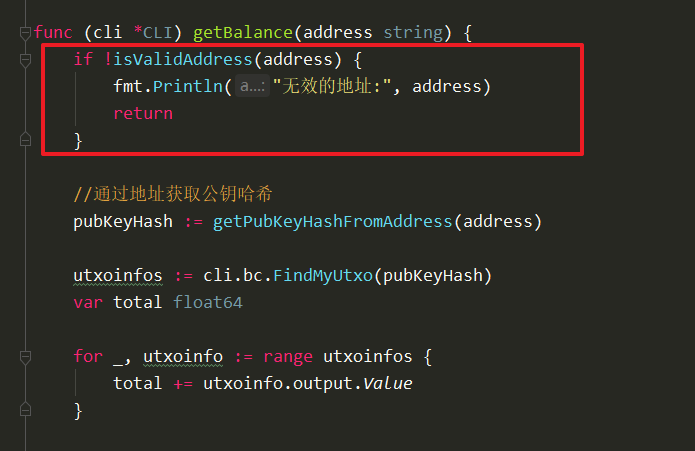


效果：

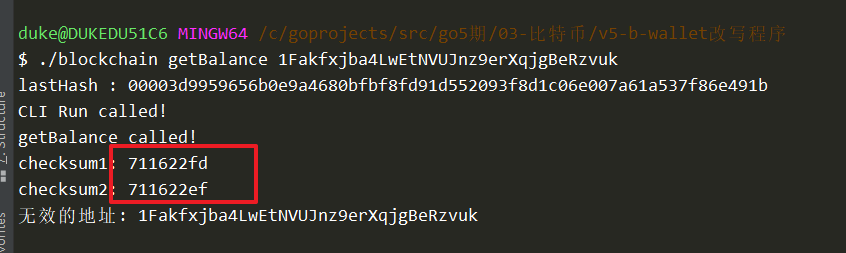


挖矿难度值推导


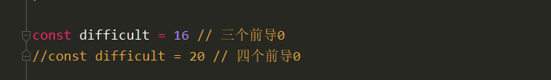


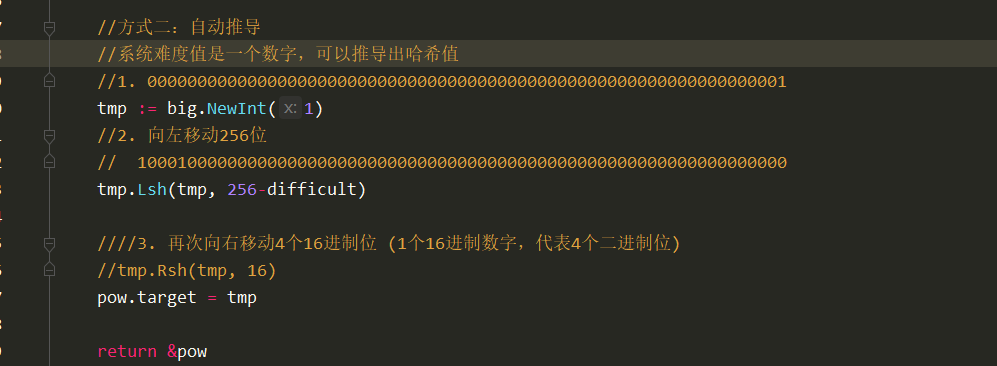

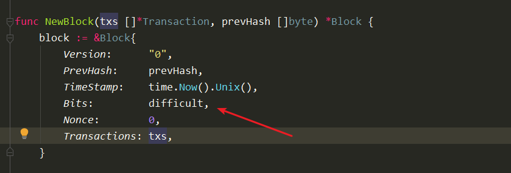


测试！


# 签名相关


需要：

1. 私钥
2. 想要签名的数据src


校验：

1. 公钥
2. 需要校验的数据src
3. 数字签名


# 到底对什么进行签名？

1. 签名：对当前的这笔交易进行
2. 这个交易里面要包含哪些数据呢：
   1. 新生成的output的公钥哈希签名（这描述了收款人）
   2. output的金额（描述了转账金额）
   3. 所引用的utxo的锁定的公钥哈希（这描述了付款人）


# 校验签名

