# 1. 使用UTXOInfo改写程序

```go
//定义一个结构，同时包含output和它的位置信息
type UtxoInfo struct {
	output TXOutput
	index  int64
	txid   []byte
}
```


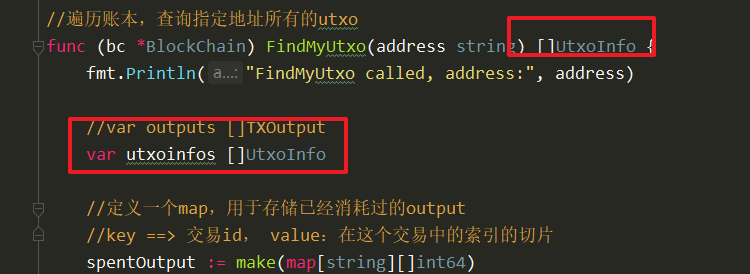


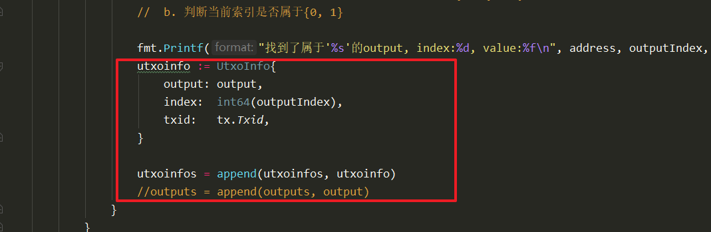


通过返回值，返回数据结构


# FindNeedUtxoInfo

FindNeedUtxoInfo(付款人，支付的金额）[ ]UtxoInfo

1. 找到满足转账需求所需要的钱，找到后立刻返回
2. 如果没有找到，则返回空切片已经0，创建交易前，会校验返回的金额是否满足转账需求，如果不满足则创建交易失败


```go
func (bc *BlockChain) FindNeedUtxoInfo(address string, amount float64) ([]UtxoInfo, float64) {
	fmt.Printf("FindNeedUtxoInfo called, address :%s, amount:%f\n", address, amount)

	//1. 遍历账本，找到所有address（付款人）的utxo集合
	utxoinfos := bc.FindMyUtxo(address)

	//返还的utxoinfo里面包含金额
	var retValue float64
	var retUtxoInfo []UtxoInfo

	//2. 筛选出满足条件的数量即可，不要全部返还
	for _, utxoinfo := range utxoinfos {
		retUtxoInfo = append(retUtxoInfo, utxoinfo)
		retValue += utxoinfo.output.Value

		if retValue >= amount {
			//满足转账需求，直接返回
			break
		}
	}

	return retUtxoInfo, retValue
}
```


# 2. 创建普通交易

分析：

1. 参数：
   1. 付款人
   2. 收款人
   3. 付款金额
   5. bc *Blockchain
2. 逻辑分析：
   1. 找到付款人能够支配的合理的钱，返回金额和utxoinfo
   2. 判断返回金额是否满足转账条件，如果不满足，创建交易失败。
   3. 拼接一个新的交易
      1. 拼装inputs
         1. 遍历返回的utxonifo切片，逐个转成input结构
      2. 拼装outputs
         1. 拼装一个属于收款人的output
         2. 判断一下是否需要找零，如果有，拼装一个属于付款方output
      3. 设置交易id
      4. 返回
   4. 


代码实现：

```go

//普通交易
func NewTransaction(from, to string, amount float64, bc *BlockChain) (*Transaction, error) {

	//1. 1. 找到付款人能够支配的合理的钱，返回金额和utxoinfo
	utxoinfos, value := bc.FindNeedUtxoInfo(from, amount)

	//2. 判断返回金额是否满足转账条件，如果不满足，创建交易失败。
	if value < amount {
		return nil, errors.New("付款人金额不足!")
	}

	//3. 拼接一个新的交易
	var inputs []TXInput
	var outputs []TXOutput

	//1. 拼装inputs
	for _, utxoinfo := range utxoinfos {
		input := TXInput{
			TXID:      utxoinfo.txid,
			Index:     utxoinfo.index,
			ScriptSig: from,
		}

		inputs = append(inputs, input)
	}
	//1. 遍历返回的utxonifo切片，逐个转成input结构
	//2. 拼装outputs
	//1. 拼装一个属于收款人的output
	output := TXOutput{
		LockScript: to,
		Value:      amount,
	}
	outputs = append(outputs, output)

	//2. 判断一下是否需要找零，如果有，拼装一个属于付款方output
	if value > amount {
		//找零
		output1 := TXOutput{
			LockScript: from,
			Value:      value - amount,
		}

		outputs = append(outputs, output1)
	}

	tx := Transaction{
		TxInputs:  inputs,
		TXOutputs: outputs,
		TimeStamp: time.Now().Unix(),
	}

	//3. 设置交易id
	tx.SetTxId()

	//4. 返回
	return &tx, nil
}
```


# UTXO：未花费交易输出

1. 在比特币系统中，手续费没有单独的字段来定义。每一笔交易的总inputs（15）与总outputs（14 + 0.5）的差值就是手续费。


2. UTXO是最小的单位，任意面值的，每次使用时，必须一次用完，生成新的UTXO


# 3. send命令实现

在cli.go中增加send命令

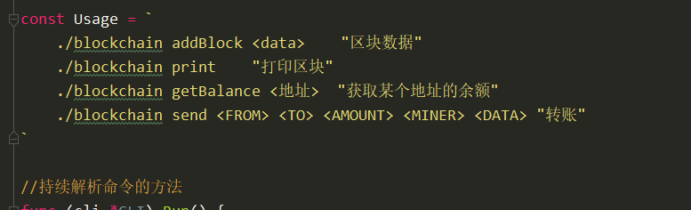


解析响应的参数：

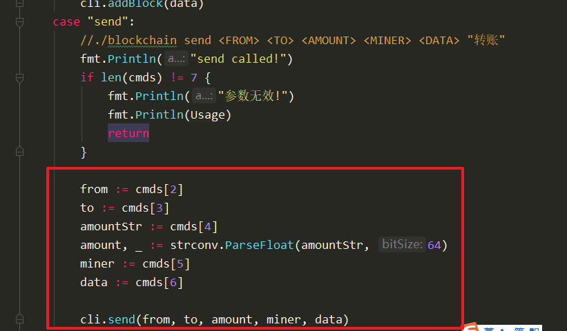


实现转账命令：

```go
func (cli *CLI) send(from, to string, amount float64, miner, data string) {
	fmt.Printf("'%s'向'%s转账:'%f', miner:%s, data:%s\n", from, to, amount, miner, data)

	//输入数据的有效性会进行校验
	//TODO

	//创建挖矿交易
	coninbaseTx := NewCoinbaseTx(miner, data)
	txs := []*Transaction{coninbaseTx}

	//一个区块只添加一笔有效的普通交易
	tx, err := NewTransaction(from, to, amount, cli.bc)
	if err != nil {
		fmt.Println("err:", err)
	} else {
		fmt.Printf("发现有效的交易，准备添加到区块, txid:%x\n", tx.Txid)
		txs = append(txs, tx)
	}

	//创建区块，添加到区块链
	cli.bc.AddBlock(txs)      
}
```


更新getBalance函数

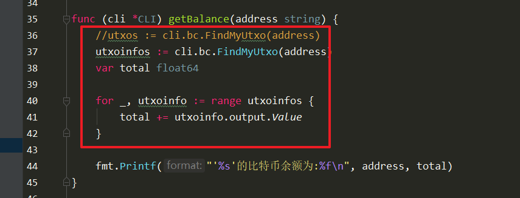

 

编译测试：

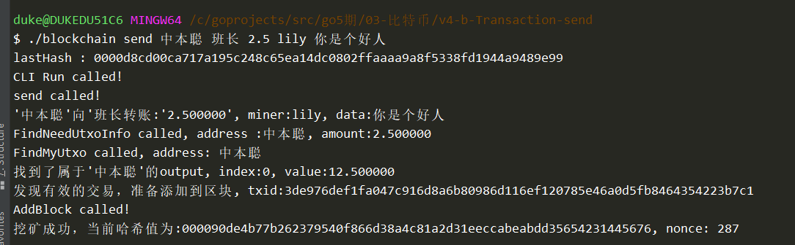


查询三个人的金额：

1. 中本聪：10
2. 班长：2.5
3. lily：12.5


# 4. 优化程序

- IsFileExist
- IsCoinbase 
- HashTransaction


判断是否为挖矿交易：

transaction.go

```go
//判断一个交易是否为挖矿交易
func (tx *Transaction) isCoinbaseTx() bool {
	input := tx.TxInputs[0]
	if len(tx.TxInputs) == 1 && input.TXID == nil && input.Index == -1 {
		return true
	}

	return false
}
```

调用：

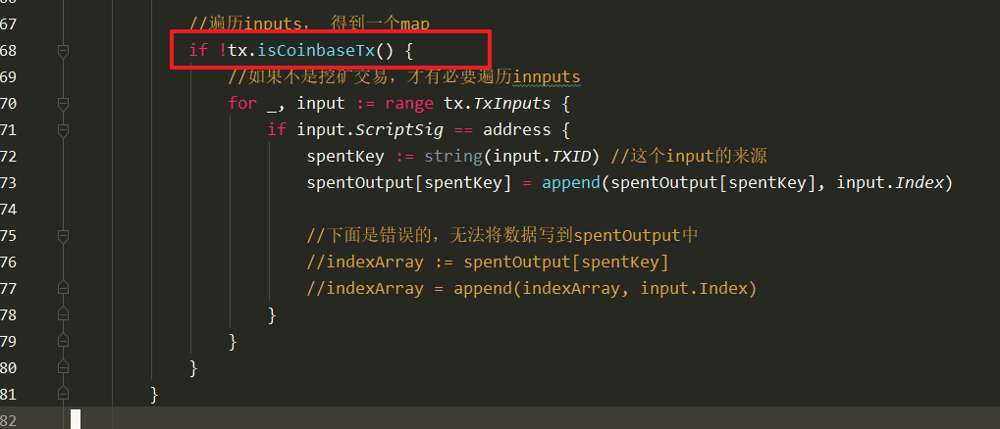


HashTransaction实现，模拟生成梅克尔根

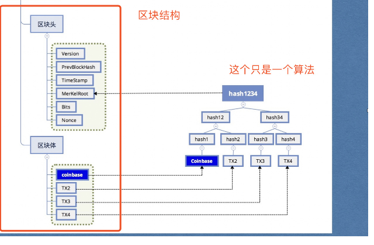


在block.go中，增加函数：

```go

//模拟计算梅克尔根
func (b *Block) HashTransaction() {
	var info []byte
	for _, tx := range b.Transactions {
		info = append(info, tx.Txid...)
	}

	hash := sha256.Sum256(info)

	b.MerkleRoot = hash[:]
}

```


在创建block中调用：

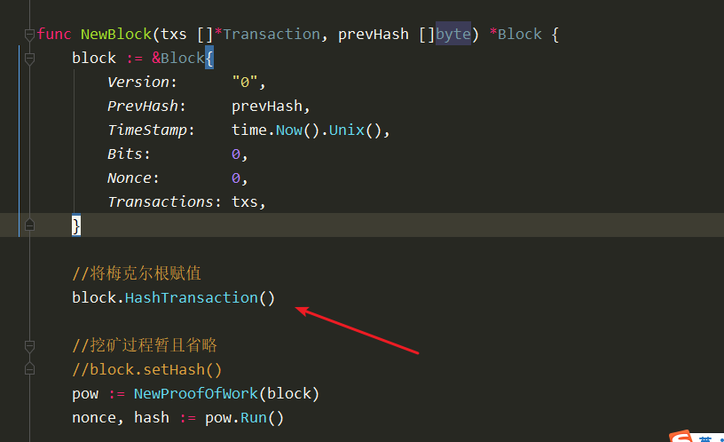


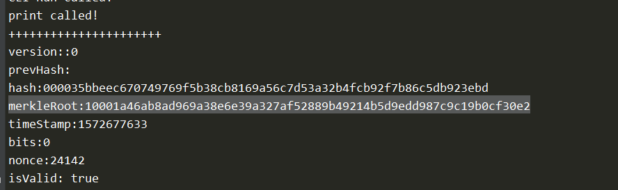


# 5. 钱包相关

## 椭圆曲线介绍

## ecdsa介绍demo

```go
package main

import (
	"crypto/ecdsa"
	"crypto/elliptic"
	"crypto/rand"
	"crypto/sha256"
	"fmt"
	"math/big"
)

func main() {
	//创建一条椭圆曲线
	curve := elliptic.P256()

	//1. 创建秘钥对
	privKey, err := ecdsa.GenerateKey(curve, rand.Reader)
	if err != nil {
		fmt.Println("生成私钥失败, err:", err)
		return
	}

	data := "hello world"

	hash := sha256.Sum256([]byte(data))

	//2. 使用私钥签名
	//r和s是数据签名
	r, s, err := ecdsa.Sign(rand.Reader, privKey, hash[:])
	fmt.Println("r len:", len(r.Bytes()))
	fmt.Println("s len:", len(s.Bytes()))

	//r与s的长度是相同的，我们将两者拼接到一起，进行传输
	//到对端，从中间分割，还原成big.Int类型即可
	signature := append(r.Bytes(), s.Bytes()...)

	//进行数据传输。。。。

	pubKey := privKey.PublicKey

	//3. 公钥验证签名

	//还原r，s
	var r1, s1 big.Int
	r1.SetBytes(signature[:len(signature)/2])
	s1.SetBytes(signature[len(signature)/2:])

	//func Verify(pub *PublicKey, hash []byte, r, s *big.Int) bool {
	//res := ecdsa.Verify(&pubKey, hash[:], &r1, &s1) ///正确的
	res := ecdsa.Verify(&pubKey, hash[:], &r1, &r1) //错误的
	fmt.Println("res :", res)
}

```

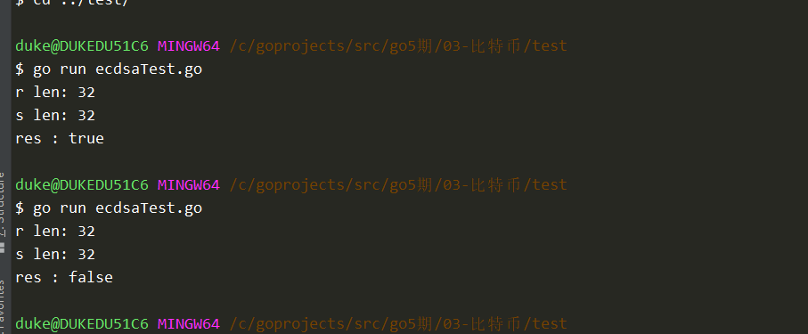


# 6. 钱包关系

私钥=》公钥=》地址

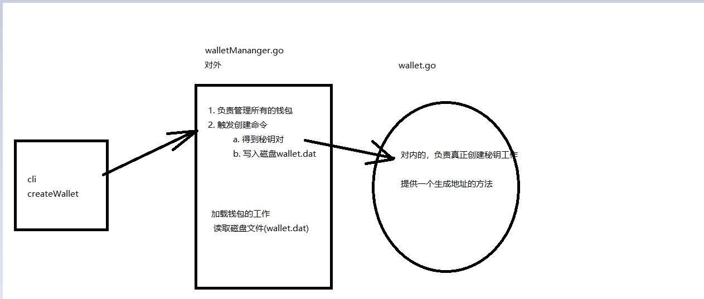


## Wallet

- ==创建秘钥对==
- ==根据公钥生成地址==


wallet.go文件，内容如下：

```go
package main

import (
	"crypto/ecdsa"
	"crypto/elliptic"
	"crypto/rand"
	"fmt"
)

type Wallet struct {
	PrivKey *ecdsa.PrivateKey
	PubKey  []byte //这不是原生的公钥，而是X, Y两个点的字节流拼成而成的
}

//<sig><pubKey> Dup Hash160 <PubKeyHash> Qqual Sig_Check
//创建一个秘钥对
func NewWallet() *Wallet {
	//私钥
	priKey, err := ecdsa.GenerateKey(elliptic.P256(), rand.Reader)
	if err != nil {
		fmt.Println("创建秘钥对失败, err:", err)
		return nil
	}
	//公钥
	pubKeyRaw := priKey.PublicKey
	x := pubKeyRaw.X
	y := pubKeyRaw.Y
	pubKey := append(x.Bytes(), y.Bytes()...)

	return &Wallet{
		PrivKey: priKey,
		PubKey:  pubKey,
	}
}
```


## 根据公钥生成地址

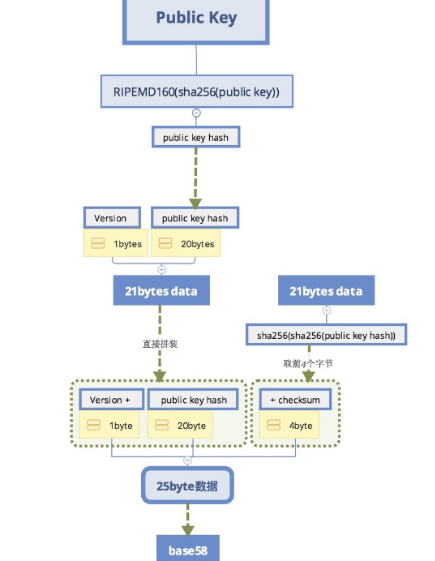

```go
func (w *Wallet) getAddress() string {
	//一、第一次哈希
	firstHash := sha256.Sum256(w.PubKey)
	//第二次哈希
	hasher := ripemd160.New()
	hasher.Write(firstHash[:])
	pubKeyHash := hasher.Sum(nil)

	//二、在前面添加1个字节的版本号
	payload := append([]byte{byte(00)}, pubKeyHash...)

	//三、做两次哈希运算，截取前四个字节，作为checksum，
	f1 := sha256.Sum256(payload)
	second := sha256.Sum256(f1[:])

	checksum := second[:4] //作闭右开

	//四、拼接25字节数据
	payload = append(payload, checksum...)

	//五、base58处理，得到地址
	address := base58.Encode(payload)
	return address
}
```


## WalletManager

- 定义结构

  1. 定义一个map来管理所有的钱包
  2. key：地址
  3. value：wallet
- 创建结构
  1. 分配空间

```go
package main

//- 定义结构
type WalletManager struct {
	//1. 定义一个map来管理所有的钱包
	//2. key：地址
	//3. value：wallet
	wallets map[string]*Wallet
}

//- 创建结构
func NewWalletMananger() *WalletManager {
	//return &WalletManager{
	//	wallets: make(map[string]*Wallet),
	//}

	var wm WalletManager
	wm.wallets = make(map[string]*Wallet)

	//加载已经存在钱包，从wallet.dat
	//TODO

	return &wm
}
```


在WalletManager.go中添加创建钱包的命令，用于cli调用：

```go
func (wm *WalletManager) createWallet() (string, error) {
	//调用wallet结构的创建方法
	w := NewWallet()

	if w == nil {
		return "", errors.New("创建钱包失败!")
	}

	//填充自己的wallets结构
	//TODO ， 放入map结构，存储到磁盘

	//返回地址
	address := w.getAddress()
	return address, nil
}
```


在cli中添加命令createWallet

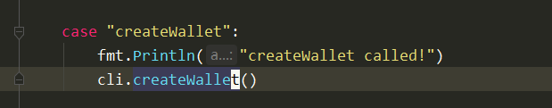


在commandline.go中调用：

```go

func (cli *CLI) createWallet() {
	wm := NewWalletMananger()
	if wm == nil {
		fmt.Println("打开钱包失败!")
		return
	}

	address, err := wm.createWallet()
	if err != nil {
		fmt.Println("创建钱包失败:", err)
		return
	}

	fmt.Println("创建新地址成功:", address)
}

```


测试：

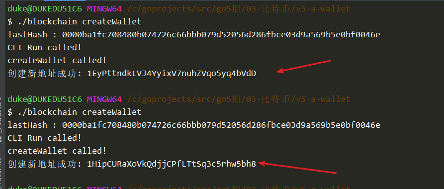


# 今日内容：


1. 钱包存储起来
2. 将钱包与程序结合
   1. 使用地址改写程序
3. 介绍签名，校验


SaveToFile存储生成的私钥对：

```go
//1. 将wm结构写入到磁盘=》向map中添加数据
//2. 使用gob对wm进行编码后写入文件
func (wm *WalletManager) saveToFile() error {
	var buff bytes.Buffer

	//对interface数据进行注册
	gob.Register(elliptic.P256())

	encoder := gob.NewEncoder(&buff)
	err := encoder.Encode(wm)
	if err != nil {
		fmt.Println("saveToFile encode err:", err)
		return err
	}

	//写入磁盘
	err = ioutil.WriteFile(walletFileName, buff.Bytes(), 0600)
	if err != nil {
		fmt.Println("saveToFile writeFile err:", err)
		return err
	}

	return nil
}
```


测试，出问题，如下：

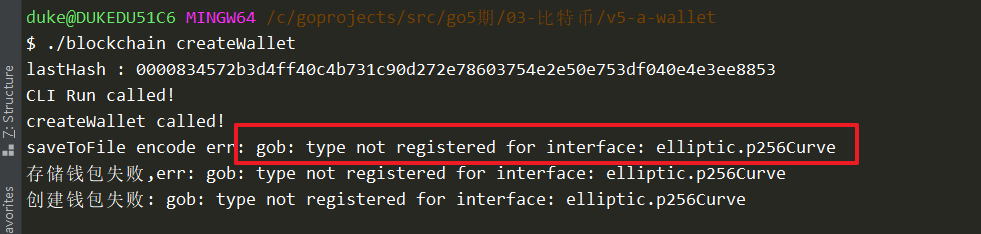


需要在gob中，进行注册，否则不知道大小，在公钥中，包含曲线结构，是一个接口类型：

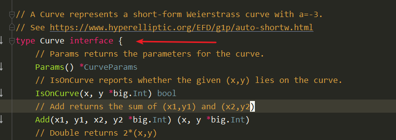


在createWallet中调用：

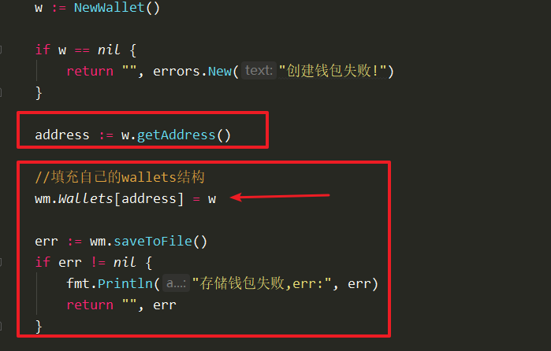


效果：

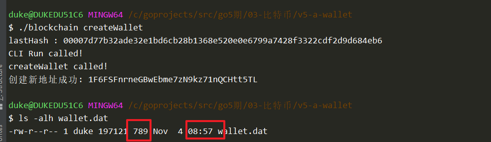


# 加载钱包函数

```go
//加载钱包里面的秘钥对
func (wm *WalletManager) loadFromFile() error {
	//1. 判断文件是否存在，如果不存在，则不需要加载
	//TODO
    
    
	//2. 文件存在，读取文件
	data, err := ioutil.ReadFile(walletFileName)
	if err != nil {
		fmt.Println("loadFromFile readFile err:", err)
		return err
	}

	//3.gob进行解码
	//注册接口函数
	gob.Register(elliptic.P256())

	decoder := gob.NewDecoder(bytes.NewReader(data))
	err = decoder.Decode(wm)
	if err != nil {
		fmt.Println("loadFromFile Decode err:", err)
		return err
	}

	return nil
}

```

调用：

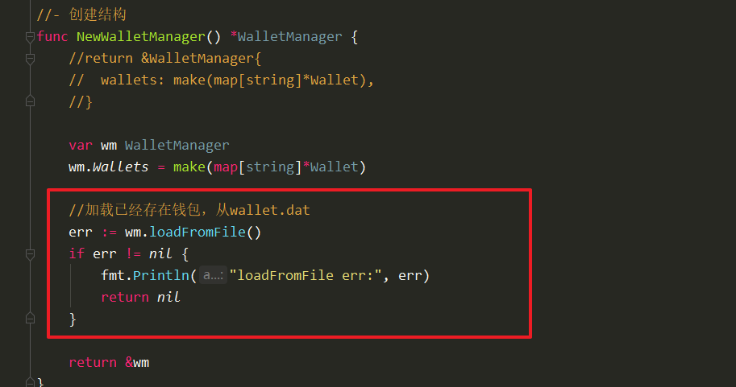


测试：（前提是已经存在了wallet.dat文件）


在utils.go中，增加函数

```go
//判断文件是否存在
func isFileExist(filename string) bool {
	_, err := os.Stat(filename)
	//通过err错误码，判断文件是否存在
    //不要使用IsExist函数，不准确!
	if os.IsNotExist(err) {
		//文件不存在
		return false
	}

	return true
}
```


在函数中调用：

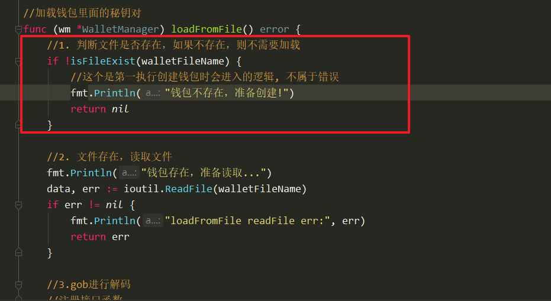


删除现有的wallet.dat，测试即可！


# 打印所有的地址

walletMananger.go中添加：

```go
func (wm *WalletManager) listAddress() (addresses []string) {
	//1. 遍历map，获取所有的key值
	for address, _ := range wm.Wallets {
		//2. 拼装成切片返回
		addresses = append(addresses, address)
	}

	//3. 将地址数组排序后返回
	//默认是升序排列
	sort.Strings(addresses)

	return
}

```


增加命令：

```go
	case "listAddress":
		fmt.Println("listAddress called!")
		cli.listAddress()

```


实现命令：

```go
func (cli *CLI) listAddress() {
	wm := NewWalletManager()
	if wm == nil {
		fmt.Println("打开钱包失败!")
		return
	}

	addressess := wm.listAddress()
	for _, address := range addressess {
		fmt.Println("address:", address)
	}
}
```


测试：

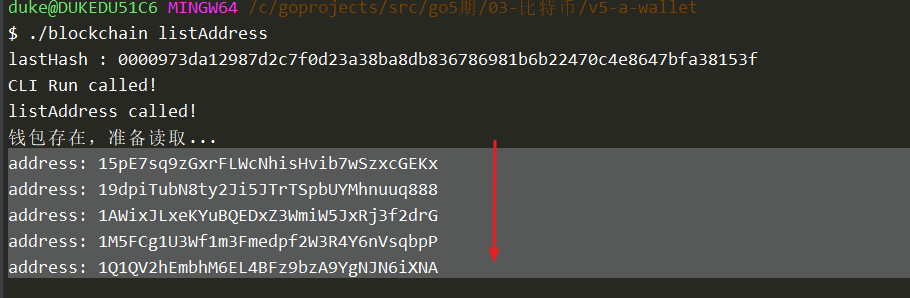